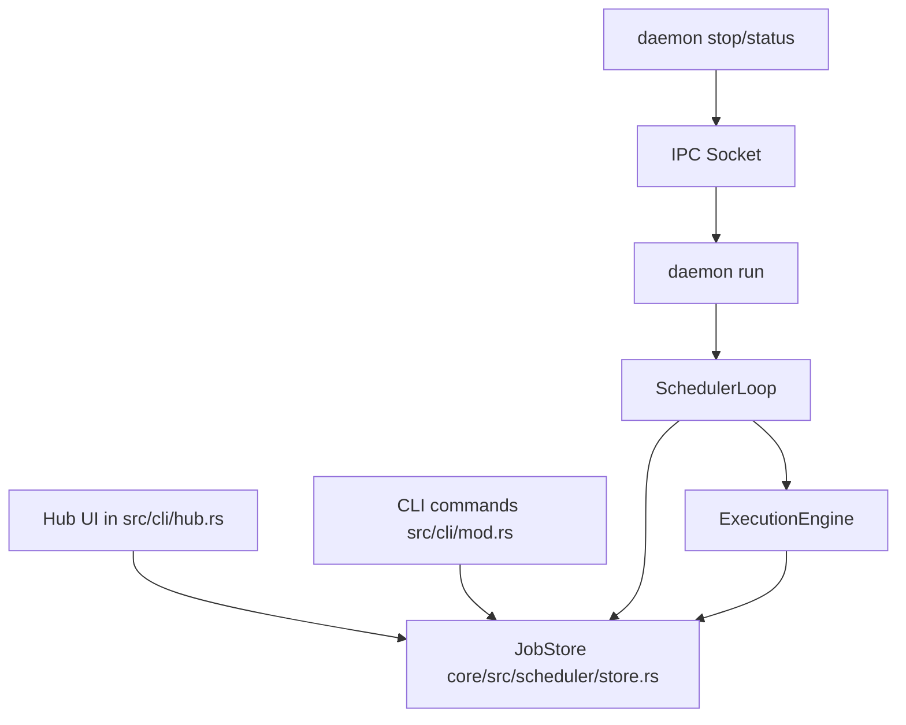

# Background Jobs and Scheduler Design for `mylm`

**Document goal**: define a simple, maintainable, cross-platform (Linux primary, macOS secondary) cron-like scheduler with **persistent jobs** and an optional **daemon mode** for unattended execution. Integrates with the existing Hub menu ([`src/cli/hub.rs`](src/cli/hub.rs)) and dispatch loop ([`src/main.rs:handle_hub()`](src/main.rs:305)).

---

## 0. High-level requirements

1. Cron-like scheduling (cron expressions and intervals)
2. Daemon mode (unattended background process)
3. Hub menu entry for create/edit/view
4. Persistence across restarts
5. Example use case: defensive security checks

Non-goals (v1): distributed scheduling, remote execution, exactly-once semantics across machine clocks, rich UI, Windows-first service integration.

---

## 1. Data model design

### 1.1 Core entities

#### `ScheduledJob`

Rust shape (illustrative; final types chosen during implementation):

```rust
pub struct ScheduledJob {
  pub id: JobId,
  pub name: String,
  pub description: Option<String>,
  pub schedule: JobSchedule,
  pub action: JobAction,
  pub enabled: bool,

  // bookkeeping
  pub created_at: DateTime<Utc>,
  pub updated_at: DateTime<Utc>,
  pub last_run: Option<JobRunRef>,
  pub next_run: Option<DateTime<Utc>>,

  // operational policy
  pub policy: JobPolicy,
}
```

Where:

- `JobId`: `uuid::Uuid` serialized as string.
- `next_run`: stored to speed up listing; recomputed on load (scheduler is source of truth).

#### `JobSchedule`

Supports cron and interval schedules.

```rust
pub enum JobSchedule {
  Cron(CronSchedule),
  Interval(IntervalSchedule),
}

pub struct CronSchedule {
  pub expression: String,
  pub timezone: JobTimezone, // default: Local
}

pub struct IntervalSchedule {
  pub every: DurationSpec, // e.g. 5m, 2h
  pub offset: Option<DurationSpec>,
  pub timezone: JobTimezone,
}

pub enum JobTimezone {
  Local,
  Utc,
  NamedTz(String),
}
```

Notes:

- `timezone` is kept explicit so that cron expressions are not ambiguous.
- If `NamedTz` is implemented, recommend using `chrono-tz` (later) or restricting to `Local|Utc` in v1.

#### `JobAction`

Three types requested; in v1 we implement **shell** and **agent task**; "delegate sub-agent" can be an alias for agent task with a specific tool.

```rust
pub enum JobAction {
  Shell(ShellAction),
  AgentTask(AgentTaskAction),
  Delegate(DelegateAction),
}

pub struct ShellAction {
  pub program: String,
  pub args: Vec<String>,
  pub cwd: Option<PathBuf>,
  pub env: std::collections::BTreeMap<String, String>,
  pub timeout_secs: Option<u64>,
}

pub struct AgentTaskAction {
  pub prompt: String,
  pub profile: Option<String>,
  pub allow_execution: bool,
  pub initial_context: AgentContextSpec,
}

pub struct DelegateAction {
  pub agent_name: Option<String>,
  pub task: AgentTaskAction,
}

pub enum AgentContextSpec {
  None,
  TerminalSnapshot,
  SystemInfoOnly,
}
```

Rationale:

- Shell action is needed for "defensive security checks".
- Agent action reuses existing agent infrastructure.

#### `JobPolicy`

Controls concurrency/backpressure.

```rust
pub struct JobPolicy {
  pub max_concurrent_runs: u32,          // default 1
  pub overlap: OverlapPolicy,            // default Skip
  pub misfire: MisfirePolicy,            // default Skip
  pub jitter_secs: Option<u32>,          // default None
}

pub enum OverlapPolicy {
  Skip,          // do not start if already running
  Queue,         // queue one pending run
  Allow,         // allow overlapping
}

pub enum MisfirePolicy {
  Skip,          // if daemon was down, do not backfill
  CatchUp(u32),  // run up to N missed occurrences
}
```

### 1.2 Run history model

Keep run history append-only and separate from job definitions.

```rust
pub struct JobRun {
  pub run_id: Uuid,
  pub job_id: JobId,
  pub scheduled_for: DateTime<Utc>,
  pub started_at: DateTime<Utc>,
  pub finished_at: Option<DateTime<Utc>>,
  pub status: JobRunStatus,
  pub exit: Option<JobRunExit>,
  pub log_path: Option<PathBuf>,
}

pub enum JobRunStatus { Running, Succeeded, Failed, Cancelled, TimedOut }

pub enum JobRunExit {
  Shell { code: Option<i32>, signal: Option<i32> },
  Agent { summary: String },
}

pub struct JobRunRef {
  pub run_id: Uuid,
  pub finished_at: DateTime<Utc>,
  pub status: JobRunStatus,
}
```

This is conceptually similar to the in-memory [`core/src/agent/v2/jobs.rs`](core/src/agent/v2/jobs.rs) but scoped to **scheduled** runs.

### 1.3 Persistence format and on-disk layout

Use JSON for v1 (simple, diffable, portable). Store under the standard user data dir:

- Linux: `$XDG_DATA_HOME/mylm/` (via `dirs::data_dir()`)
- macOS: `~/Library/Application Support/mylm/`

Directory layout:

```
{data_dir}/mylm/
  scheduled_jobs/
    jobs.json
    runs.jsonl
    logs/
      {job_id}/
        {run_id}.log
    daemon/
      pid
      lock
      socket
```

Files:

- `jobs.json`: authoritative list of scheduled jobs (array or map by id).
- `runs.jsonl`: append-only JSON Lines for run events (start/finish) to avoid rewriting large arrays.
- logs: one file per run; path stored in `JobRun.log_path`.
- daemon files: used for lifecycle and IPC.

Atomicity strategy:

- write `jobs.json` via temp file + atomic rename.
- append `runs.jsonl` with `O_APPEND`.

Schema versioning:

```rust
pub struct JobsFile {
  pub schema_version: u32, // start at 1
  pub jobs: Vec<ScheduledJob>,
}
```

---

## 2. Scheduler architecture

### 2.1 In-process scheduler core (shared by CLI and daemon)

Create a scheduler component in `mylm-core` so both the daemon binary path and interactive hub can list/edit jobs consistently.

Key components:

1. `JobStore`
   - load/save `jobs.json`
   - append run events to `runs.jsonl`
   - list runs, tail logs

2. `ScheduleParser`
   - parse cron expressions
   - parse interval strings (e.g. `5m`, `2h`, `1d`)

3. `NextRunCalculator`
   - compute `next_run` given schedule + timezone + last known firing time

4. `SchedulerLoop`
   - maintains in-memory heap/priority queue keyed by `next_run`
   - wakes at min(next_run, control message)
   - emits `JobDue { job_id, scheduled_for }` into `ExecutionQueue`

5. `ExecutionEngine`
   - executes `JobAction`
   - captures logs
   - updates run history
   - enforces `JobPolicy` (overlap/misfire)

### 2.2 Cron parsing crate recommendation

Prefer `cron` crate for parsing expressions and computing upcoming occurrences.

Reasoning:

- Smaller surface area than a full scheduler framework.
- Fits the "keep it simple" constraint.
- Scheduler loop remains in-house and testable.

Alternative: `tokio-cron-scheduler` if we want built-in job store + orchestration. Downside: larger abstraction and less control over persistence format.

### 2.3 Next-run computation

Pseudo:

1. Determine `base_time`:
   - if job has `last_run.scheduled_for` (or last known fire time), use that
   - else use `now`
2. Use schedule implementation:
   - Cron: find next occurrence strictly after `base_time`
   - Interval: `next = align(now/offset) + every`
3. Apply jitter if configured.
4. Store `next_run` back into `jobs.json` (optional) for UI display.

### 2.4 Execution engine details

#### Shell execution

- Use `tokio::process::Command`.
- Enforce timeout via `tokio::time::timeout`.
- Capture stdout/stderr and write to log file as streaming.

#### Agent task execution

- Instantiate agent via existing factory ([`core/src/factory.rs`](core/src/factory.rs)).
- Provide minimal context in daemon mode:
  - `TerminalSnapshot` is likely not meaningful unattended; prefer `SystemInfoOnly` or `None`.
- For safety: default `allow_execution=false` unless explicitly enabled per job.

#### Concurrency controls

- Global semaphore for total concurrent runs (configurable; default small, e.g. 2).
- Per-job policy enforcement:
  - track running count per job
  - `OverlapPolicy::Skip`: if running>0, mark due run as skipped and record a `JobRun` with status `Cancelled` or `Failed` with reason.
  - `Queue`: allow 1 pending run; drop additional.

### 2.5 Logging and output capture

Log format per run:

```
timestamp | level | job_id | run_id | message
```

Capture:

- Scheduler events (job due, skipped)
- Execution start/finish
- Shell stdout/stderr lines (prefixed)

Store location: `{data_dir}/mylm/scheduled_jobs/logs/{job_id}/{run_id}.log`.

---

## 3. CLI and Hub integration

### 3.1 Hub integration

Add a new hub choice:

- `HubChoice::BackgroundJobs` in [`src/cli/hub.rs`](src/cli/hub.rs)
- Add to display list and options in [`src/cli/hub.rs:show_hub()`](src/cli/hub.rs:117)
- Add dispatch handler in [`src/main.rs:handle_hub()`](src/main.rs:305)

Submenu choices (Hub flow):

1. List Jobs
2. Create Job
3. Edit Job
4. Enable/Disable Job
5. View Job Runs
6. View Logs (select run)
7. Daemon: Status
8. Daemon: Start (best-effort)
9. Daemon: Stop
10. Back

Implementation pattern: similar to existing settings dashboards in [`src/cli/hub.rs`](src/cli/hub.rs) (inquire selections + helper handlers).

### 3.2 CLI commands (non-hub)

Add a top-level subcommand group:

```
mylm jobs list
mylm jobs create
mylm jobs edit <job_id>
mylm jobs enable <job_id>
mylm jobs disable <job_id>
mylm jobs runs <job_id>
mylm jobs logs <run_id>

mylm daemon run
mylm daemon start
mylm daemon stop
mylm daemon status
```

Wiring occurs in [`src/cli/mod.rs`](src/cli/mod.rs) and the main match in [`src/main.rs`](src/main.rs).

### 3.3 Job creation wizard flow

Wizard steps (interactive):

1. Name + optional description
2. Action type selection: Shell / Agent Task / Delegate
3. Action details:
   - Shell: program, args (space-separated parsing), cwd, env (key=value entries)
   - Agent Task: prompt, profile, allow_execution, context spec
4. Schedule type selection: Cron / Interval
5. Schedule input:
   - Cron: expression, timezone
   - Interval: every (e.g. `5m`), optional offset
6. Policy (optional): overlap, timeout, jitter
7. Confirm and save

Validation:

- cron expression parses
- interval parses
- shell program non-empty
- agent prompt non-empty

---

## 4. Daemon mode design

### 4.1 Lifecycle commands

#### `mylm daemon run`

- Runs the scheduler in foreground.
- Intended for systemd/launchd and for debugging.
- Owns the socket and lock.

#### `mylm daemon start`

- Best-effort spawn of a detached child on Unix.
- On macOS/Linux: spawn `mylm daemon run` with stdio redirected to a daemon log file.
- On unsupported platforms: print instruction to use `daemon run` with a service manager.

#### `mylm daemon stop/status`

- Connect to local IPC socket and request stop/status.

### 4.2 Locking / single instance

Use a lock file `{data_dir}/mylm/scheduled_jobs/daemon/lock`.

- Acquire exclusive lock at daemon startup.
- If lock is held, daemon refuses to start.

Implementation options:

- Use `fs2` crate for cross-platform file locks.
- Or implement Unix-only `flock` via `nix` (less portable).

### 4.3 PID file

Write `{data_dir}/mylm/scheduled_jobs/daemon/pid` after acquiring lock.

- Used only for user display and fallback debugging.
- Not authoritative for stop (socket is authoritative).

### 4.4 IPC design

Socket path:

- Unix: `{data_dir}/mylm/scheduled_jobs/daemon/socket` as Unix domain socket.
- Fallback: TCP loopback `127.0.0.1:{port}` if UDS not available (optional).

Protocol: newline-delimited JSON.

Requests:

```json
{ "type": "status" }
{ "type": "stop" }
{ "type": "ping" }
{ "type": "list_jobs" }
{ "type": "run_now", "job_id": "..." }
```

Responses:

```json
{ "ok": true, "type": "status", "pid": 1234, "running": true, "jobs": 12, "next_wakeup": "..." }
{ "ok": true, "type": "stop" }
{ "ok": false, "error": "..." }
```

Rationale:

- Avoid reusing the existing websocket server ([`src/server/mod.rs`](src/server/mod.rs)) to keep v1 small.
- IPC surface can expand later.

### 4.5 systemd service template (Linux)

Template:

```ini
[Unit]
Description=mylm background jobs scheduler
After=network.target

[Service]
Type=simple
ExecStart=/usr/local/bin/mylm daemon run
Restart=on-failure
RestartSec=3

[Install]
WantedBy=default.target
```

### 4.6 launchd template (macOS)

Use a `LaunchAgent` plist (user-level) that runs `mylm daemon run`.

---

## 5. File structure and integration points

### 5.1 New modules/files (proposed)

In `mylm-core`:

- [`core/src/scheduler/mod.rs`](core/src/scheduler/mod.rs)
- [`core/src/scheduler/model.rs`](core/src/scheduler/model.rs) (ScheduledJob, JobRun, enums)
- [`core/src/scheduler/store.rs`](core/src/scheduler/store.rs) (JobStore: load/save, runs.jsonl, logs)
- [`core/src/scheduler/schedule.rs`](core/src/scheduler/schedule.rs) (cron/interval parse + next-run)
- [`core/src/scheduler/executor.rs`](core/src/scheduler/executor.rs) (shell + agent execution)
- [`core/src/scheduler/daemon.rs`](core/src/scheduler/daemon.rs) (scheduler loop + IPC server)

In `mylm` (binary crate):

- [`src/cli/jobs.rs`](src/cli/jobs.rs) (hub submenu helpers + non-hub commands)
- [`src/cli/daemon.rs`](src/cli/daemon.rs) (daemon start/stop/status/run)

Data file is created under `dirs::data_dir()`; no repository files required.

### 5.2 Existing files to modify

- [`src/cli/hub.rs`](src/cli/hub.rs): add hub entry and submenu
- [`src/main.rs`](src/main.rs): dispatch hub choice + new CLI command handling
- [`src/cli/mod.rs`](src/cli/mod.rs): add clap subcommands (`jobs`, `daemon`)
- [`core/src/lib.rs`](core/src/lib.rs): export scheduler module

### 5.3 Dependencies to add (proposed)

In workspace `Cargo.toml` (binary crate) or `core/Cargo.toml` depending on where implemented:

- `cron` for cron parsing
- `fs2` for lock files

Avoid heavy scheduler frameworks initially.

---

## 6. Example jobs (defensive security checks)

1. Update + audit (daily):

- Schedule: `Cron: 0 3 * * *` (03:00 local)
- Action (shell):
  - `program: bash`
  - `args: ["-lc", "sudo apt update && sudo apt -y upgrade && sudo apt -y autoremove"]`

2. File integrity scan (hourly):

- Schedule: `Interval: 1h`
- Action: run `lynis audit system` or `chkrootkit` if installed.

---

## 7. Mermaid: component overview



