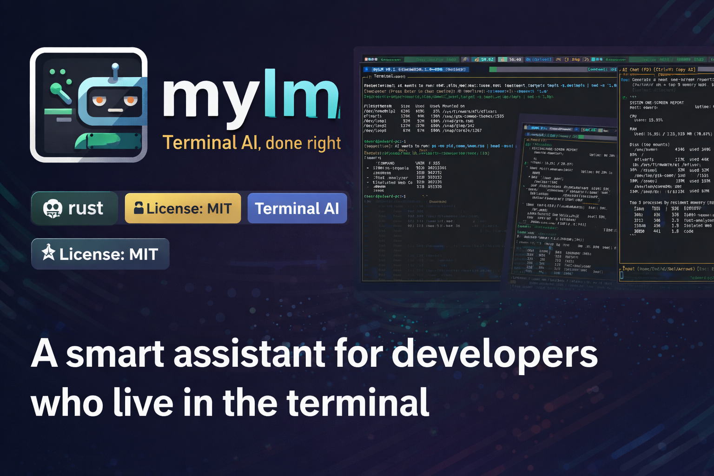
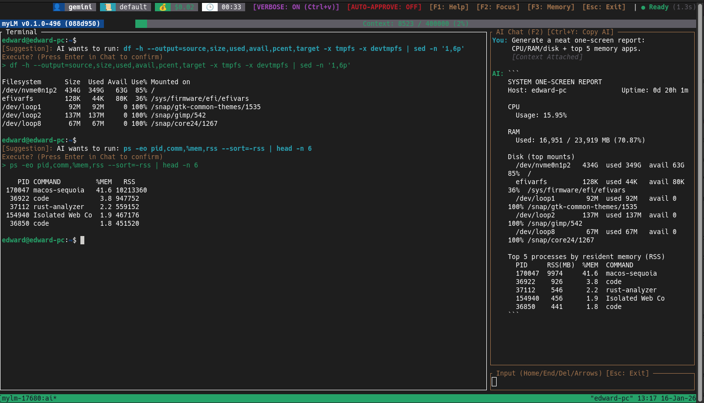

# mylm — Terminal AI, done right
[](https://www.rust-lang.org/)
[](https://opensource.org/licenses/MIT)
[](#)



**mylm (My Language Model)** is a high-performance **Terminal AI Assistant** built for developers who actually spend their day in the CLI. 



It’s not a fancy chatbot wrapper or a toy script. `mylm` is an **agentic terminal companion** that understands your system, reasons through tasks, and bridges natural language with actual shell execution.

You install it as the `ai` command, and it fits right into your workflow instead of getting in the way.

---

## What makes it different?

Most "AI CLI tools" are just thin API frontends: stateless, slow, and blind to your environment. `mylm` treats the terminal as a first-class citizen.

### ⚡ Pop Terminal & Context (`ai pop`)
This is the "killer feature." `ai pop` grabs your current `tmux` pane history, running processes, and env vars, and drops them into an AI session. You don't have to copy-paste errors; the AI is already looking at them.

### 🫧 Clean UI & Smart Reflow
Commands run in the background so they don't clutter your chat, but the AI still sees every bit of output. The TUI (powered by `ratatui`) handles window resizing perfectly without breaking the layout.

### 🧠 Agentic Loop (Think-Plan-Execute)
In interactive mode, the AI doesn't just talk. It uses a ReAct loop to:
1.  **Reason** about your request.
2.  **Plan** a multi-step solution.
3.  **Execute** shell commands, check git, or search the web.
*Everything is guarded by your approval.*

### 🖥 Context Awareness
`mylm` automatically tracks:
*   Your current directory (CWD).
*   Git status (branch, diffs, logs).
*   System info (OS, CPU, etc.).
*   Execution history.

### 🌐 Live Web Search & Crawling
Built-in tools for real-time searching and crawling. No more stale training data—if there’s a new library update, `mylm` can find the docs.

### 🔁 Multi-Provider Support
One interface for everything:
*   **Local**: Ollama, LM Studio.
*   **Cloud**: Gemini, OpenAI, Anthropic, DeepSeek.

### 🗂 Local Memory (RAG)
Includes a local vector database (LanceDB) to store project notes, past decisions, and technical references so the AI gets smarter the more you use it.

---

## Installation

### Prerequisites
*   **Rust** (if you don't have it, the installer will help).
*   **tmux** (highly recommended for the `pop` feature).
*   **System dependencies**: Libraries like `OpenSSL`, `libxcb`, `clang`, and `protobuf`.

### Build from source (No-Sudo)
```bash
git clone https://github.com/ediblackk/mylm.git
cd mylm
chmod +x install.sh
./install.sh
```

**Note on Installation:**
*   **No Sudo Required**: The installer is designed to be **strictly no-sudo**. It installs everything into your home directory (`~/.local/bin`).
*   **Rust Environment**: If the installer installs Rust for you via `rustup`, you **must** restart your terminal or run `source $HOME/.cargo/env` before you can use `cargo` or the `ai` command in new sessions.
*   **System Dependencies**: Since the script doesn't use `sudo`, it cannot install system libraries for you. If any are missing, it will provide you with the exact command to run for your specific distribution.
*   **Configuration Note**: Profile configuration wizard fails during installation, simply save and exit (or move on) and configure your providers post-installation via the central hub (`ai`).

---

## Usage / Quickstart

### 1. The Hub (`ai`)
Running `ai` with no arguments opens the central Hub. From here you can:
*   Start a new interactive session.
*   Resume a past conversation (memory is persistent!).
*   Configure your LLM provider and keys.

### 2. Contextual Pop (`ai pop`)
This is the most powerful way to use `mylm`.
1.  You run a command and it fails (e.g., a complex `cargo build` error).
2.  Type `ai pop`.
3.  `mylm` captures the last screen of output, your current directory state, and environment.
4.  Ask: "Fix this error."
5.  It already knows the error because it "saw" your terminal.

### 3. Quick Query (`ai "query"`)
For simple questions where you don't need a full session:
```bash
ai "how do I tar a directory excluding .git?"
```

### 4. Interactive Mode (`ai interactive`)
Starts a fresh session focused on the current directory but without capturing the previous command output.

## Configuration
Settings are in `~/.config/mylm/mylm.yaml`. You can edit prompts, switch models, and manage API keys directly in the UI.

## Troubleshooting

### "Command not found" after install
Ensure `~/.local/bin` is in your `PATH`.
```bash
export PATH="$HOME/.local/bin:$PATH"
```
Add this line to your `~/.bashrc` or `~/.zshrc` to make it permanent.

### "Error initializing backend"
This often happens if the API key is missing or invalid. Run `ai` and select **Configuration** to verify your keys.

### Visual Glitches
`mylm` uses advanced terminal manipulation. If you see rendering issues:
*   Ensure you are using a modern terminal emulator (Alacritty, iTerm2, Kitty, Windows Terminal).
*   Try resizing the window to force a redraw.

## Roadmap
*   **V2 Cognitive Engine**: Transitioning to a multi-layered worker architecture.
*   Background task queues.
*   Master-agent orchestration.

## Contributing

We love contributions! Please see our [CONTRIBUTING.md](CONTRIBUTING.md) for details on how to get started, code style, and PR guidelines.

---

## Acknowledgements
Built on the shoulders of giants: **Rust, Linux, Git, ratatui, tokio, lancedb**, and the amazing research from **Google, Anthropic, OpenAI, Meta, and the Open Source AI community.**

---

## Keywords
Terminal AI, CLI LLM, Rust AI tool, Local LLM assistant, Ollama CLI, OpenAI terminal, Anthropic Claude CLI, Gemini terminal, Developer productivity, Command-line AI, tmux AI, Agentic Loop, ReAct Agent.
