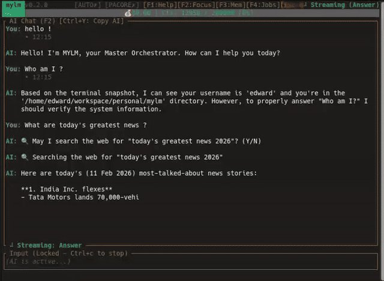
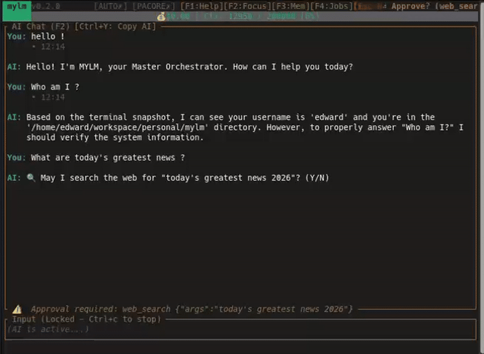
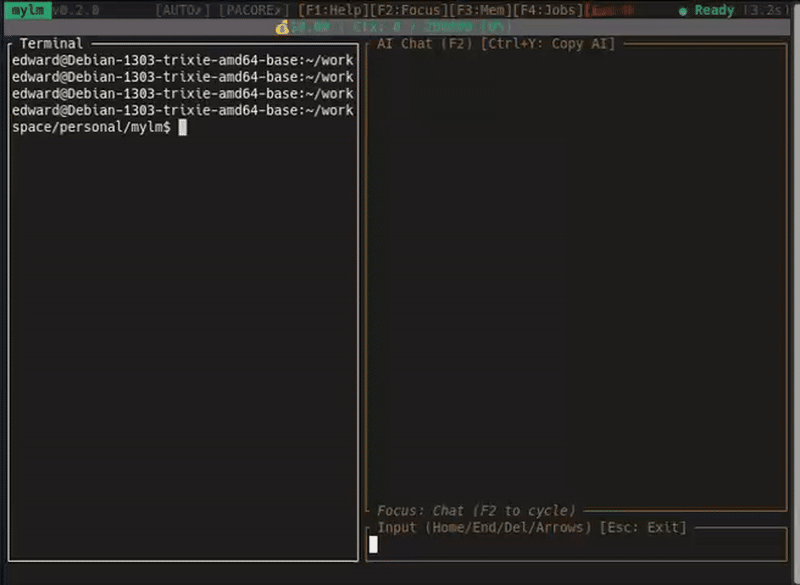

# My Language Model

[](https://www.rust-lang.org/)
[](https://opensource.org/licenses/MIT)
[](.)

<table>
  <tr>
    <td align="center"><b>Basic Usage</b></td>
    <td align="center"><b>Chat Interface</b></td>
    <td align="center"><b>Terminal Integration</b></td>
  </tr>
  <tr>
    <td></td>
    <td></td>
    <td></td>
  </tr>
</table>


## Safe Personal AI assistance into your terminal

**MyLM** is a privacy-focused, multi-agent terminal AI assistant built in Rust. It can see in your terminal, remember your projects, delegates tasks to specialized sub-agents, and safely executes commands—all while keeping you in control.

### Features

- **Intelligent file reading** — Automatic chunking for large files, PDF extraction, partial reads
- **Full-text search** — Tantivy-powered search across all accessed files
- **Persistent vector memory** — LanceDB with semantic search across sessions
- **Multi-agent orchestration** — Parallel workers with job tracking
- **Full terminal context** — tmux integration, zero manual context sharing
- **Background job system** — Async delegation, non-blocking
- **Safety-first execution** — Allowlists, approval workflow, PTY isolation
- **Lightweight & fast** — Fast cold starts and quick execution

---

## Quick Start

### Installation

git clone https://github.com/ediblackk/mylm.git

cd mylm

chmod +x install.sh

./install.sh

Installs to `~/.local/bin` without sudo.

### First Use

Unless you changed the alias, simply type "ai" into your terminal to open the central hub where you can change your settings, start new sessions or resume old ones.

---

## ✨ What Makes mylm Special
Considering you have enabled tmux
### 🎯 `ai pop` — Context Magic
mylm captures your terminal history, working directory, git state, environment variables, and recent commands. The AI sees exactly what you see. **No setup. No copy-paste. Just context.**

*Requires tmux (we'll help you set it up).*

### 🧠 Multi-Agent System
Most AI assistants are a single brain trying to do everything. mylm uses an **orchestrator-worker pattern**:

- **Orchestrator** chats, plans and delegates
- **Delegate tool** spawns worker agents with their own toolsets
- **Worker agents** execute subtasks in parallel
- **Job registry** tracks progress across all agents

### KNOWN ISSUES / SOLVING SOON
- **Context grows uncontrollably** - when simply conversating with some history, context can grow way more than required; most likely some repeated data/content not caching; 
- **On stall, workers are not approved to contine** - in order to prevent unending loops, wasted resources and precise actions, sub-agent workers require approval for more actions after a number of actions (15); as they reach it, main agent does not react and does not allow further actions;
- **Memory needs refining** - scribe function is currently disabled; it is suppossed to continuously memorise actions and information, and inject information relevant to context to make the main model aware; this adds complexity and for basic functions is a bit overkill; totally refining this later though;
- **Code organisation and cleanup** - I am aware there is still mess around in  codebase; my main concern was to finish it and have something fast, stable and usable in day to day tasks; so far I am glad with how it runs, it's my first Rust project and I love it.


### 🔄 PaCoRe: Parallel Consensus Reasoning
(https://github.com/stepfun-ai/PaCoRe)
When accuracy matters, mylm can run **multi-round reasoning**:
1. Spawn multiple parallel LLM calls with different reasoning paths
2. Let them critique and build on each other's answers
3. Synthesize a consensus response

Better answers for complex debugging and architecture decisions.

### 🛡️ Safety-First Execution
Every command goes through:
1. **Static analysis** — Pattern-based risk detection
2. **Allowlist checking** — Known safe commands
3. **User approval** — You see it before it runs


### 🌐 15+ Built-in Tools

**File & Code Operations:**
- **read_file** — Read files with intelligent chunking for large files (>100KB auto-chunked)
  - Partial reads: `line_offset` and `n_lines` parameters
  - PDF text extraction support
  - Multiple strategies: `direct`, `chunked`, `search`, `auto`
- **write_file** — Write content to files
- **list_files** — List directory contents
- **search_files** — Full-text search across indexed files (Tantivy-powered)
- **git** — Status, log, diff analysis

**Execution & Safety:**
- **shell** — Execute with safety checks and approval workflow
- **delegate** — Spawn parallel sub-agents for large tasks

**Information & Memory:**
- **web_search** — Real-time web search
- **memory** — Long-term semantic memory (LanceDB)
- **scratchpad** — Agent-local persistent notes
- **commonboard** — Inter-agent coordination

**System:**
- **terminal_sight** — Capture terminal state (tmux integration)
- **system** — Resource monitoring

### ⚡ Built for Speed
- **Rust** — Zero-cost abstractions, memory safety
- **Async tokio** — Non-blocking I/O throughout
- **Optimized profiles** — Fast compile in dev, LTO in release

---

## ⚙️ Configuration

mylm stores configuration in `~/.config/mylm/config.toml`:

```toml
[workers]
max_persistent_workers = 5  # Max chunk workers for large files (1-50)
tantivy_enabled = true      # Enable full-text search indexing
```

### Large File Reading

Files are automatically handled based on size:
- **< 10KB**: Direct read
- **10-100KB**: Direct read with token warning
- **100KB-1MB**: Chunked reading (parallel workers)
- **> 1MB**: Search-based reading with Tantivy

Chunk workers persist until the session ends, allowing follow-up questions about specific parts of large files.

## 🔒 Security & Privacy

- **Local-first**: Vector DB and search index run locally
- **No telemetry**: Your data stays yours
- **Command safety**: Approval workflow, allowlists, pattern detection
- **API key handling**: Stored in config, never logged
- **Sandboxed execution**: Commands run in isolated PTY

---

## 🛠️ Supported Providers

**Local (Free, Private):**
- Ollama
- LM Studio
- HuggingFace (via inference API)

**Cloud (API Key Required):**
- Any OpenAI Compatible endpoint
- Google Gemini 3
- OpenAI (GPT-5.2)
- Anthropic (Claude Sonnet 4.5)
- DeepSeek V3.2
- StepFun 3.5 Flash
- Kimi K2.5 (Moonshot)

---

## 🙏 Acknowledgements

Built with assistance from every AI that would talk to me: Claude, GPT, Gemini,
Kimi, DeepSeek, StepFun, Z.AI, MiniMax and probably others I've forgotten. Also 147 Rust crates I didn't write. And Linux/Debian.And VS Code. And ASUS. And liters of coffee.

---

## 📄 License

MIT — See [LICENSE](LICENSE) for details.