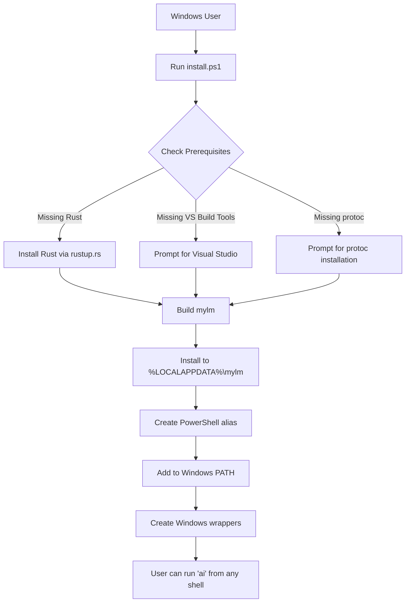

# Windows Installation Strategy for mylm

## Executive Summary

This document outlines a native Windows installation strategy for mylm that provides feature parity with Linux/macOS installations while addressing Windows-specific challenges.

## Analysis of Current Installation Process

### Linux/macOS Dependencies Identified

From analyzing [`install.sh`](install.sh) and [`dev-install.sh`](dev-install.sh):

**Core Build Dependencies:**
- Rust/Cargo (required)
- OpenSSL development libraries
- XCB libraries (libxcb1-dev, libxcb-render0-dev, libxcb-shape0-dev, libxcb-xfixes0-dev)
- clang compiler
- cmake build system
- pkg-config
- protobuf-compiler (protoc)

**Runtime Dependencies:**
- tmux (critical for terminal context capture)
- sccache (build acceleration)
- mold linker (Linux-specific optimization)

**Configuration & Installation:**
- Config directory: `~/.config/mylm/mylm.yaml`
- Binary installation: `~/.local/bin/mylm`
- Shell integration: bash/zsh/fish RC files
- PATH management: User-local bin directory

### Windows Compatibility Challenges

**Linux-Specific Code:**
- Unix process management (`fuser` command)
- Package manager detection (apt, dnf, pacman, brew)
- Shell RC file manipulation (.bashrc, .zshrc, config.fish)
- Unix signals (TERM, KILL)
- Hardcoded Unix paths and commands

**Windows-Specific Issues:**
- No native tmux equivalent (terminal context feature)
- Different OpenSSL library handling (requires vcpkg or manual setup)
- No mold linker support
- PowerShell vs CMD vs WSL path conflicts
- Windows Terminal vs ConHost differences
- Process management differences

## Windows Installation Strategy

### Recommended Approach: Native PowerShell Installation

**Rationale:**
- Provides true native Windows experience
- No WSL2 dependency
- Direct Windows path integration
- PowerShell-native features and conventions
- Better performance (no virtualization overhead)

**Trade-offs:**
- No tmux integration (terminal context feature disabled)
- Manual dependency installation required
- Different build optimization profile
- PowerShell-specific shell integration

### Architecture Overview



### Path Mapping Strategy

| Linux/macOS Path | Windows Equivalent | Environment Variable |
|------------------|-------------------|---------------------|
| `~/.config/mylm/` | `%APPDATA%\mylm\` | `$env:APPDATA\mylm` |
| `~/.local/bin/mylm` | `%LOCALAPPDATA%\mylm\bin\mylm.exe` | `$env:LOCALAPPDATA\mylm\bin\mylm.exe` |
| `~/.bashrc` / `~/.zshrc` | `$PROFILE` (PowerShell) | `$PROFILE.CurrentUserAllHosts` |
| `/tmp/` | `%TEMP%` | `$env:TEMP` |

### Feature Parity Matrix

| Feature | Linux/macOS | Windows | Implementation Notes |
|---------|-------------|---------|---------------------|
| **Core AI Functionality** | ✅ Full | ✅ Full | No changes required |
| **Terminal Context** | ✅ Tmux-based | ⚠️ Limited | Windows Terminal panes as alternative |
| **Shell Integration** | ✅ bash/zsh/fish | ✅ PowerShell | Function wrappers instead of aliases |
| **Build Optimization** | ✅ sccache + mold | ⚠️ sccache only | No mold linker on Windows |
| **Configuration** | ✅ YAML-based | ✅ YAML-based | Same format, different path |
| **Auto-updates** | ✅ Git-based | ✅ Git-based | Same mechanism |
| **Process Management** | ✅ fuser-based | ✅ Handle-based | Different implementation |

## Implementation Components

### 1. PowerShell Installation Script (`install.ps1`)

**Core Functions:**
- `Install-RustIfNeeded` - Downloads and installs rustup.rs
- `Install-SystemDependencies` - Checks for protoc, VS Build Tools
- `Build-Binary` - Executes cargo build with Windows-specific flags
- `Install-Binary` - Copies binary to `%LOCALAPPDATA%\mylm\bin\`
- `Add-ToPath` - Adds installation directory to user PATH
- `Set-PowerShellAlias` - Creates PowerShell function wrapper
- `Set-TmuxAutoStart` - Provides Windows Terminal alternative guidance

**Key Differences from install.sh:**
- PowerShell error handling (`$ErrorActionPreference = "Stop"`)
- Windows process management (handle-based instead of fuser)
- Registry-based PATH manipulation
- PowerShell profile integration instead of RC files
- Static linking for easier deployment (`RUSTFLAGS = "-C target-feature=+crt-static"`)

### 2. Windows Wrapper Scripts

**Batch Wrapper (`ai.cmd`):**
```batch
@echo off
%LOCALAPPDATA%\mylm\bin\mylm.exe %*
```

**PowerShell Wrapper (`ai.ps1`):**
```powershell
param([Parameter(ValueFromRemainingArguments=$true)]$Arguments)
& "$env:LOCALAPPDATA\mylm\bin\mylm.exe" @Arguments
```

### 3. Configuration Management

**Windows-Specific Config Location:**
- Primary: `%APPDATA%\mylm\mylm.yaml`
- Fallback: `%USERPROFILE%\.config\mylm\mylm.yaml` (for WSL compatibility)

**Environment Variables:**
- `MYLM_CONFIG_DIR` - Override config directory
- `MYLM_PREFIX` - Override installation prefix
- `RUST_LOG` - Enable debug logging

### 4. Build Configuration

**Cargo.toml Modifications for Windows:**
```toml
[target.'cfg(windows)'.dependencies]
# Windows-specific dependencies if needed

[profile.release]
opt-level = 3
lto = true
codegen-units = 1
strip = true
# Static linking for easier distribution
target-feature = "+crt-static"
```

## Installation Workflow

### Prerequisites Check

1. **Rust/Cargo**: Install via rustup.rs if missing
2. **Visual Studio Build Tools**: Required for C++ compilation
3. **protoc**: Protocol Buffers compiler
4. **vcpkg**: Optional but recommended for OpenSSL

### Build Process

1. Set Windows-specific environment variables
2. Configure static linking
3. Run cargo build (release or debug)
4. Enable sccache if available
5. Handle build errors with Windows-specific guidance

### Installation Process

1. Create installation directory structure
2. Copy binary to `%LOCALAPPDATA%\mylm\bin\`
3. Create Windows wrapper scripts
4. Add to user PATH (registry modification)
5. Create PowerShell alias function
6. Initialize configuration directory

### Post-Installation

1. Run setup wizard for API key configuration
2. Create Windows Terminal profile (optional)
3. Create Start Menu shortcut (optional)
4. Verify installation with `mylm --version`

## Windows-Specific Considerations

### Terminal Context Alternative

Since tmux is not available on Windows, provide alternatives:

1. **Windows Terminal**: Multi-pane support
2. **PowerShell History**: Use PSReadLine history
3. **Manual Context**: User can pipe command output to mylm
4. **Future Enhancement**: Windows Terminal API integration

### Process Management

Replace Unix `fuser` with Windows handle-based approach:

```powershell
function Test-BinaryBusy {
    param([string]$TargetPath)
    try {
        $fileStream = [System.IO.File]::Open($TargetPath, 'Open', 'ReadWrite', 'None')
        $fileStream.Close()
        return $false
    }
    catch {
        return $true
    }
}
```

### Error Handling

Windows-specific error scenarios:

1. **Missing MSVC**: Provide download link
2. **OpenSSL Issues**: Guide to vcpkg installation
3. **PATH Too Long**: Warn and provide manual instructions
4. **Antivirus Interference**: Add exclusion guidance
5. **Windows Defender**: SmartScreen bypass instructions

## Testing Strategy

### Test Matrix

| Windows Version | Architecture | Terminal | Expected Result |
|-----------------|--------------|----------|-----------------|
| Windows 11 | x64 | Windows Terminal | ✅ Full functionality |
| Windows 10 | x64 | PowerShell 7 | ✅ Full functionality |
| Windows 10 | x64 | CMD | ✅ Limited functionality |
| Windows 11 | ARM64 | Windows Terminal | ⚠️ Build from source |

### Test Scenarios

1. **Fresh Installation**: Clean system, no Rust installed
2. **Update Existing**: Previous version installed, config preserved
3. **Path Conflicts**: Existing 'ai' command, handle gracefully
4. **Build Failure**: Missing dependencies, clear error messages
5. **PATH Modification**: Verify persistence across sessions

## Documentation Requirements

### User-Facing Documentation

1. **WINDOWS_INSTALL.md**: Step-by-step installation guide
2. **TROUBLESHOOTING.md**: Windows-specific issues and solutions
3. **README.md**: Update with Windows installation section

### Developer Documentation

1. **BUILD_WINDOWS.md**: Windows build environment setup
2. **PORTING.md**: Guidelines for maintaining Windows compatibility
3. **TESTING.md**: Windows testing procedures

## Future Enhancements

### Phase 2: Enhanced Windows Integration

1. **Windows Terminal API**: Native terminal context capture
2. **MSIX Package**: Windows Store distribution
3. **Winget Package**: Native Windows package manager
4. **PowerShell Module**: Proper module with cmdlets
5. **Windows Notifications**: Native toast notifications

### Phase 3: Feature Parity

1. **Terminal Context**: Windows Terminal integration
2. **Process Management**: Native Windows job objects
3. **Auto-update**: Windows Update integration
4. **System Tray**: Background service with GUI

## Conclusion

This Windows installation strategy provides a robust, native Windows experience while maintaining compatibility with the existing Linux/macOS codebase. The PowerShell-based approach leverages Windows-native features and conventions, providing users with a familiar installation experience.

**Key Success Metrics:**
- Zero WSL2 dependency
- Feature parity for core AI functionality
- PowerShell-native integration
- Clear upgrade path from Linux/macOS
- Maintainable codebase with minimal divergence

**Next Steps:**
1. Create `install.ps1` PowerShell script
2. Modify build configuration for Windows static linking
3. Create Windows wrapper scripts
4. Update documentation
5. Test across Windows versions and configurations