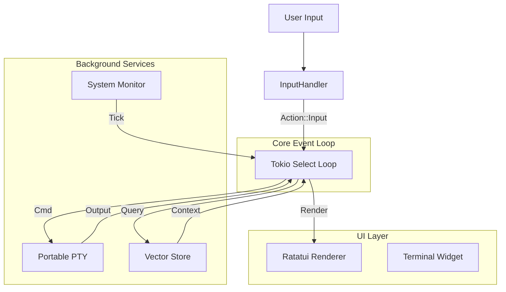

# Technical Architecture: mylm Advanced Features

## 1. Overview
This document outlines the architectural design for integrating a robust TUI with terminal emulation, a local RAG system, and an adaptive context engine into `mylm`. The system leverages an asynchronous event loop architecture to manage concurrency between UI rendering, background tasks, and user interaction.

## 2. Crate Selection & Justification

### 2.1 TUI & Terminal Emulation
*   **`ratatui`**: The de facto standard for building rich Terminal User Interfaces in Rust. It offers a component-based architecture and wide community support.
*   **`tui-term`**: A widget library for `ratatui` that specifically handles the rendering of a terminal emulator state. This avoids reinventing the wheel for VT100/ANSI parsing.
*   **`portable-pty`**: Provides cross-platform pseudo-terminal (PTY) abstractions. It allows us to spawn shell processes (like `bash` or `zsh`) and capture their I/O, which `tui-term` then renders.
*   **`crossterm`**: Used for low-level terminal manipulation and input event handling (keyboard, mouse, resize).

### 2.2 Local RAG (Retrieval-Augmented Generation)
*   **`lancedb`**: A serverless, embedded vector database. It persists data to local storage (disk) without needing a separate background process/server. It is highly performant and integrates well with Rust.
*   **`fastembed`**: A Rust library for generating text embeddings locally using ONNX Runtime. It supports popular models like `all-MiniLM-L6-v2` without requiring an external API call, ensuring privacy and speed.

### 2.3 Async Runtime & Utilities
*   **`tokio`**: The standard async runtime for Rust. We will use `tokio::select!` for the main event loop to handle TUI events, PTY I/O, and background tasks simultaneously.
*   **`sysinfo`**: Already present, used for system monitoring (heartbeat).

## 3. System Design

### 3.1 High-Level Architecture
The application is structured around a central **Event Loop** that orchestrates communication between three main subsystems: the **UI Layer**, the **Agent Core**, and the **Background Services**.

### 3.2 Module Structure
*   **`src/tui/`**:
    *   `app.rs`: State management for the TUI (active tabs, panes, input buffers).
    *   `ui.rs`: Rendering logic using `ratatui` widgets.
    *   `event.rs`: Input handling and event definition.
*   **`src/rag/`**:
    *   `store.rs`: Interface for `lancedb` operations (add, search).
    *   `embed.rs`: Wrapper for `fastembed` to generate vector embeddings.
*   **`src/agent/`**:
    *   `loop.rs`: The main async run loop.
    *   `terminal.rs`: Wrapper for `portable-pty` interaction.

## 4. Data Schemas (RAG)

The vector store will maintain a collection of "Chunks" derived from project files or conversation history.

**Table: `knowledge_base`**

| Field | Type | Description |
| :--- | :--- | :--- |
| `id` | String (UUID) | Unique identifier for the chunk. |
| `content` | String | The actual text content. |
| `vector` | Vec<f32> | The embedding vector (size depends on model, e.g., 384). |
| `source` | String | File path or "chat_history". |
| `timestamp` | Int64 | Unix timestamp of when it was indexed. |

## 5. Heartbeat & Adaptive Context

### 5.1 Heartbeat
A background task runs on a set interval (e.g., 1 second). It gathers system metrics (CPU, RAM) using `sysinfo` and sends a `Tick` event to the main loop. This ensures the TUI remains responsive and can update status bars even when idle.

### 5.2 Adaptive Context
The `ContextManager` will dynamically construct the prompt context based on available tokens:
1.  **System Prompt**: Fixed instruction set.
2.  **RAG Results**: Top-K relevant chunks fetched from `lancedb` based on the user query.
3.  **Recent History**: Sliding window of chat messages, truncated to fit remaining token budget.

## 6. Implementation Strategy

### Step 1: Foundation (Async TUI)
*   Refactor `main.rs` to initialize the `Action` / `Event` channels.
*   Implement the basic `ratatui` rendering loop driven by `tokio::select!`.
*   Verify keyboard input handling and clean exit.

### Step 2: Terminal Embedding
*   Integrate `portable-pty` to spawn a shell.
*   Implement `tui-term` widget to render PTY output.
*   Handle PTY resizing events.

### Step 3: Local RAG
*   Set up `lancedb` and define the schema.
*   Implement document ingestion (reading files -> chunking -> embedding).
*   Implement vector search query mechanism.

### Step 4: Integration
*   Connect RAG search to the Chat interface.
*   Visualize system stats from the Heartbeat in the TUI header.
*   Finalize styling and UX.