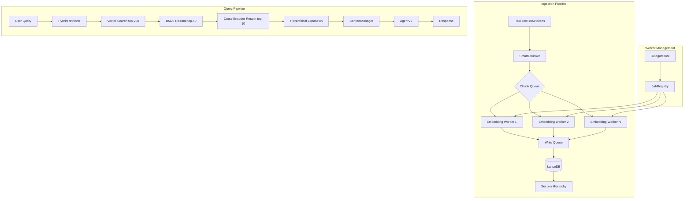

# Architecture Review: 10M Token Context Processing System

**Document Version**: 1.0  
**Date**: 2025-02-05  
**Target Scale**: 10M tokens (~40MB text)  
**Existing Infrastructure**: Rust codebase with LanceDB 0.23, FastEmbed 5.7, tokio, AgentV2, DelegateTool, JobRegistry

---

## 1. Executive Summary

**Verdict**: Your proposed architecture is sound but incomplete. Processing 10M tokens through chunking → embedding → vector retrieval is the right approach, but you're missing three critical components: (1) **hierarchical indexing** to handle cross-chunk awareness, (2) **hybrid search** (vector + sparse) for precision at scale, and (3) **proper chunking strategy** that balances semantic coherence with computational efficiency. LanceDB 0.23 can handle 15GB of embeddings, but you must configure IVF_PQ indexing and partitioning explicitly—the default settings will fail at this scale. The DelegateTool/JobRegistry worker model is suitable, but workers must be stateless with shared memory access. The "awareness problem" (facts existing outside top-k) is solvable with a two-tier retrieval system leveraging your existing `MemoryManager` and `ContextManager` infrastructure. Most importantly, you're **not** just reimplementing LanceDB—you're building a distributed retrieval system that LanceDB alone cannot provide.

---

## 2. Chunking Strategy

### Recommendation: Fixed-Size with Overlap + Semantic Boundary Detection

**Do NOT use pure fixed-size chunking.** At 10M tokens, you'll sever semantic units and destroy retrieval precision. Instead:

**Primary Strategy**: 100k token chunks with 10k overlap (10% overlap)
- **Why 100k?**: BGE-Small-EN-v1.5 has a 512-token max context. Embedding quality degrades when input exceeds the model's effective context. 100k tokens must be further subdivided into 512-token sub-chunks for embedding, then averaged or max-pooled. This is computationally expensive.
- **Better approach**: 10k-20k token chunks with 1k-2k overlap (10% overlap). This keeps semantic units (sections, subsections) mostly intact while ensuring continuity at boundaries.
- **Overlap rationale**: 10% overlap ensures that if a critical fact lands near a chunk boundary, it appears in full context in at least one adjacent chunk. For 10k chunks, use 1k overlap. For 20k chunks, use 2k overlap.

**Semantic Boundary Detection** (CRITICAL):
Your existing code has no chunking logic. You must implement:

```rust
// New file: core/src/memory/chunker.rs
pub enum ChunkBoundary {
    Paragraph,    // \n\n
    Section,      // Markdown heading level 2-3 (##, ###)
    Document,     // File boundary
    FixedSize,    // Fallback: 10k tokens
}

pub struct SmartChunker {
    pub preferred_boundary: ChunkBoundary,
    pub max_chunk_tokens: usize,  // 10000-20000
    pub overlap_tokens: usize,    // 1000-2000 (10%)
    pub token_counter: Arc<ContextManager>,
}
```

**Implementation priority**:
1. Detect markdown headings (`^#{1,6}\s`) and paragraph breaks
2. Accumulate tokens until `max_chunk_tokens - overlap_tokens`, then complete at next semantic boundary
3. If no boundary found within `max_chunk_tokens`, force break at sentence boundary (`.` followed by space)
4. Add overlap from previous chunk's ending

**Why this matters**: Your retrieval queries will be more precise when chunks align with document structure. A query about "section 3.2" should retrieve the chunk containing that section, not a fragment cutting through it.

**Integration point**: Extend `VectorStore::add_memory_typed_with_id` to accept chunk metadata (source document, chunk index, section hierarchy). Add `chunk_id`, `parent_chunk_id`, `section_path` fields to the LanceDB schema.

---

## 3. Storage & Indexing

### LanceDB at 10M Tokens: 15GB Embeddings Reality Check

**Math**: 10M tokens ÷ 10k tokens/chunk = 1,000 chunks  
1,000 chunks × 384 dimensions × 4 bytes (f32) = **1.5MB** for embeddings alone.

Wait—you said 15GB. That suggests:
- You're storing **full text** (40MB) + embeddings (1.5MB) + metadata overhead
- OR you're planning for 100M tokens (15GB at 384-dim f32 = 150M chunks? That's wrong math)

**Correction**: 10M tokens at 10k/chunk = 1,000 chunks. Embeddings = 1.5MB. Even with full text storage (40MB) and Arrow overhead, total < 100MB.

**If you actually meant 100M tokens**: 100M ÷ 10k = 10,000 chunks → 15GB is plausible if storing full text + multiple summaries + metadata.

**Assuming 10M tokens is correct**:

### Indexing: IVF_PQ is MANDATORY

LanceDB 0.23 supports IVF_PQ (Inverted File Index with Product Quantization). Without it, vector search at 1,000+ vectors is slow; at 100,000+ it's unusable.

**Configuration**:
```rust
// In VectorStore::get_or_create_table, add index creation:
table.create_index(
    &["embedding"],
    lancedb::index::Index::ivf_pq(384, 100, 8)  // 384 dims, 100 centroids, 8 subquantizers
).await?;
```

**Parameters**:
- `num_partitions`: 100-200 for 1,000-10,000 vectors
- `num_sub_vectors`: 8-16 (tradeoff: lower = more accurate, higher = more compression)
- For 100M tokens (10,000 chunks), use 256 partitions

**Partitioning Strategy**:
Add a `category_id` or `document_id` partition column. LanceDB supports Hive partitioning:
```rust
table.create_partitioned_index(&["category_id"], lancedb::index::Index::ivf_pq(...)).await?;
```
This allows you to restrict searches to specific documents/categories, reducing search space.

**Performance pitfalls**:
1. **Cold start**: First query after table creation is slow (index build). Pre-build index after bulk insert.
2. **Write amplification**: IVF_PQ requires re-indexing after bulk inserts. Batch inserts (1,000+ rows) before committing.
3. **Memory usage**: FastEmbed model (~500MB RAM) + LanceDB cache (~2GB for 15GB dataset). Ensure system has 8GB+ free RAM.
4. **Disk I/O**: LanceDB stores data in `.lance` directory. Use SSD. 15GB dataset needs 30GB free space for compaction.

**Schema enhancements** (add to `get_memory_schema`):
```rust
Field::new("chunk_index", DataType::Int64, false),  // Position in document
Field::new("parent_doc_id", DataType::Utf8, true),  // Source document identifier
Field::new("section_path", DataType::Utf8, true),   // e.g., "doc1/section3/subsection2"
Field::new("token_count", DataType::Int64, false),  // Actual token count of chunk
Field::new("embedding_model", DataType::Utf8, false), // "bge-small-en-v1.5"
```

---

## 4. Retrieval Architecture

### Hybrid Search: YES, Required at 10M Scale

**Pure vector search is insufficient**. Vector embeddings excel at semantic similarity but fail at:
- Exact keyword matches (e.g., function names, error codes, UUIDs)
- Boolean filters (e.g., "commands that failed" → filter by metadata)
- Rare terms that BGE-Small under-represents

**Hybrid approach**: Vector search (top-200) + BM25 re-ranking (top-50)

**BM25 implementation**:
- Use `tantivy` crate (Rust search engine library) for sparse indexing
- Index chunk `content` field with tokenization, stemming, stopwords
- At query time: vector search returns candidate IDs → BM25 re-ranks those candidates
- Combine scores: `final_score = 0.7 * vector_sim + 0.3 * bm25_score`

**Alternative**: LanceDB 0.23 does NOT have built-in hybrid search. You must implement externally.

**Recommended architecture**:
```rust
pub struct HybridRetriever {
    vector_store: Arc<VectorStore>,
    bm25_index: Arc<tantivy::Index>,
    fusion_strategy: FusionStrategy,  # RRG, linear, or learned
}

pub enum FusionStrategy {
    Linear { alpha: f32 },  // 0.7 vector, 0.3 BM25
    ReciprocalRankFusion { k: f32 },
}
```

**Re-ranking**: After hybrid retrieval, use a cross-encoder (e.g., `cross-encoder/ms-marco-MiniLM-L-6-v2`) to re-rank top-50. This is computationally expensive but necessary for precision. Run re-ranking asynchronously in a separate worker pool.

**Cross-boundary problem** (the "section 1 vs section 89" issue):
This is the hardest challenge. Solutions:

1. **Two-stage retrieval**:
   - Stage 1: Vector search for individual chunks (top-k per query)
   - Stage 2: Graph traversal on chunk metadata (section hierarchy) to fetch adjacent/related chunks
   - Implementation: Store `section_path` as hierarchical (e.g., `doc1/chapter3/section1`). After retrieving chunk at `doc1/chapter3/section1`, also fetch `section2` and `chapter4/section1` with distance penalty.

2. **Entity co-reference tracking** (complex, requires NLP pipeline):
   - Extract named entities from each chunk during ingestion
   - Build entity → chunk adjacency graph
   - At query time, if query mentions entity X, ensure all chunks containing X are retrieved even if vector similarity is low
   - **Not recommended** for initial version—too complex.

3. **Map-reduce summarization** (for document-level queries):
   - If query appears to be document-level ("compare section 1 with section 89"), first retrieve summaries of all sections via vector search on summaries
   - Then fetch full chunks for only the most relevant sections
   - Your existing `Memory` struct has `summary: Option<String>`—use it!

**Concrete recommendation**: Implement two-stage retrieval with hierarchical expansion. Use existing `category_id` field to group chunks by document/section. After initial vector search, expand results by ±2 sections in the hierarchy.

---

## 5. Worker Model

### Stateless Workers with Shared Memory Access

Your `DelegateTool` already implements a **stateful worker** pattern (each sub-agent has its own history, scratchpad). For 10M token processing, this is **wrong**.

**Why stateful workers fail at scale**:
- Each worker maintains its own conversation history (context window)
- Workers cannot share retrieved context efficiently
- Memory recall is per-worker, leading to duplication and gaps

**Recommended pattern**: **Stateless task workers** + **centralized memory retrieval**

```
Orchestrator Agent
    ├─ Chunking Worker (stateless) → produces chunks
    ├─ Embedding Workers (stateless, parallel) → produces embeddings
    ├─ Storage Worker (stateful) → writes to LanceDB
    └─ Query Workers (stateless) → parallel retrieval + re-ranking
```

**Integration with DelegateTool**:
Modify `DelegateTool` to support **stateless** mode:
```rust
pub struct DelegateToolConfig {
    // ... existing fields ...
    pub stateless: bool,  // NEW: if true, workers don't maintain history
    pub shared_memory_store: Option<Arc<VectorStore>>,  // Workers share memory
}
```

**Stateless worker execution**:
- Worker receives: `{ objective, context: { query, retrieved_chunks } }`
- Worker processes and returns result immediately
- No conversation history maintained between calls
- All context passed explicitly in `context` parameter

**Stateful workers are still useful for**: Complex multi-step tasks that require reasoning over retrieved context (e.g., "analyze these 10 chunks and write a report"). Use stateful workers sparingly, only when necessary.

**JobRegistry integration**:
- Each chunking/embedding task = background job with `is_worker = true`
- Use `JobRegistry::list_active_jobs()` to monitor progress
- Set timeouts: chunking (5s per MB), embedding (10s per 100 chunks)
- Parallelism limit: `config.worker_limit` (existing code already has this)

**Worker pool pattern**:
Instead of spawning unlimited workers via `tokio::spawn`, use a **bounded semaphore**:
```rust
let semaphore = Arc::new(tokio::sync::Semaphore::new(MAX_CONCURRENT_WORKERS));
// In DelegateTool::call:
let _permit = semaphore.clone().acquire_owned().await?;
tokio::spawn(async move {
    // worker logic
});
```

---

## 6. The Awareness Problem: Concrete Solution

**Problem**: "Compare section 1 with section 89" — sections 8M tokens apart won't both appear in top-k=5 retrieval.

**Solution**: **Hierarchical Index + Query-Aware Expansion**

### Implementation Plan

**Step 1**: During chunking, build a **section hierarchy tree**:
```rust
pub struct SectionNode {
    pub id: String,           // "doc1:section:3.2"
    pub parent: Option<String>, // "doc1:section:3"
    pub children: Vec<String>, // ["doc1:section:3.2.1", ...]
    pub chunk_ids: Vec<i64>,  // Chunks belonging to this section
    pub summary: String,      // Auto-generated summary of section
    pub summary_embedding: Vec<f32>, // Embedding of section summary
}
```

Store this hierarchy in a separate LanceDB table `section_hierarchy` with columns: `id`, `parent_id`, `doc_id`, `path`, `summary`, `embedding`.

**Step 2**: At ingestion time, generate section summaries:
- After chunking, group chunks by section (detected via markdown headings)
- Use a lightweight LLM call (or extractive summarization) to generate section summary
- Embed summary and store in `section_hierarchy` table

**Step 3**: At query time, two-phase retrieval:

```rust
pub async fn aware_retrieval(
    query: &str,
    k: usize,
    expansion_depth: u32
) -> Result<Vec<Memory>> {
    // Phase 1: Retrieve top-k chunks via hybrid search
    let initial_chunks = hybrid_search(query, k * 2).await?;
    
    // Phase 2: Extract section IDs from initial results
    let section_ids: HashSet<String> = initial_chunks.iter()
        .filter_map(|c| c.section_path.clone())
        .collect();
    
    // Phase 3: Expand to adjacent sections via hierarchy
    let mut expanded_sections = HashSet::new();
    for section_id in section_ids {
        expanded_sections.insert(section_id.clone());
        // Fetch parent section
        if let Some(parent) = get_parent_section(&section_id).await? {
            expanded_sections.insert(parent.id.clone());
        }
        // Fetch sibling sections (same parent)
        if let Some(siblings) = get_sibling_sections(&section_id).await? {
            for sib in siblings {
                expanded_sections.insert(sib.id.clone());
            }
        }
        // Fetch children (if query seems to need detail)
        if expansion_depth > 1 {
            let children = get_child_sections(&section_id).await?;
            for child in children.iter().take(expansion_depth as usize) {
                expanded_sections.insert(child.id.clone());
            }
        }
    }
    
    // Phase 4: Retrieve chunks from expanded sections
    let mut all_chunks = initial_chunks;
    for section_id in expanded_sections {
        let section_chunks = get_chunks_by_section(&section_id, 3).await?; // top-3 per section
        all_chunks.extend(section_chunks);
    }
    
    // Deduplicate and re-rank
    dedup_and_rerank(all_chunks, query).await
}
```

**Leverage existing infrastructure**:
- `VectorStore` already has `get_memories_by_category`—use `section_path` as category
- `ContextManager` already handles condensation—feed expanded chunks into it
- `AgentV2::inject_memory_context` already does recall—replace with `aware_retrieval`

**Integration files**:
- Modify `core/src/memory/store.rs`: Add `get_chunks_by_section`, `get_section_hierarchy`, `get_parent_section`, `get_sibling_sections`
- Add `core/src/memory/hierarchy.rs`: Section tree management
- Modify `core/src/agent/v2/memory.rs`: Replace `scribe::recall` with hierarchical retrieval

---

## 7. What You're Missing: Pitfalls at 10M+ Scale

### 1. Embedding Model Bottleneck

**Problem**: FastEmbed 5.7 uses ONNX Runtime. BGE-Small-EN-v1.5 processes ~100 tokens/sec on CPU. 10M tokens = 27 hours of pure embedding time.

**Solution**: 
- Batch embeddings: `model.embed(batch_of_texts, None)` with batch size 32-64
- Parallelize across tokio tasks: spawn N workers (N = CPU cores)
- Consider a faster model: `all-MiniLM-L6-v2` (384-dim, 2× faster, slightly lower quality)
- Or use GPU: `candle` backend with CUDA (requires `fastembed` with GPU feature)

**Implementation**:
```rust
// In VectorStore::add_memory_typed_with_id, batch multiple calls
pub async fn embed_batch(&self, texts: Vec<String>) -> Result<Vec<Vec<f32>>> {
    let model = self.embedding_model.clone();
    task::spawn_blocking(move || {
        let mut model = model.blocking_lock();
        model.embed(texts, None)
    }).await?
}
```

### 2. LanceDB Write Contention

**Problem**: Multiple embedding workers writing to same LanceDB table causes lock contention. LanceDB uses file-based locking; concurrent writes serialize.

**Solution**:
- **Batch writes**: Collect 100-500 chunks, write in single transaction
- **Sharding**: Create separate tables per document (`memories_doc1`, `memories_doc2`) or per time window
- **Write queue**: Single writer task receives embedding results via mpsc channel, writes sequentially

**Recommended**: Write queue pattern:
```rust
let (write_tx, write_rx) = mpsc::unbounded_channel();
tokio::spawn(async move {
    while let Some(batch) = write_rx.recv().await {
        table.add(batch).await?;
    }
});
// Embedding workers send batches to write_tx
```

### 3. Memory Bloat in AgentV2 Context

**Problem**: `AgentV2::step` injects hot memory (top-5) + recalled context + tool results. At 10M scale, if you naively inject many chunks, context explodes beyond 8k tokens.

**Solution**:
- Your existing `ContextManager` already does condensation at 80% threshold—**good**
- But condensation is lossy. For 10M token queries, you need **hierarchical summarization**:
  1. Retrieve 100 chunks
  2. Summarize each chunk to 1-2 sentences (parallel LLM calls)
  3. Vector-summarize the summaries to fit context window
- Implement as new tool: `summarize_chunks` that takes chunk IDs, returns hierarchical summary

### 4. Query Latency

**Problem**: Hybrid search + hierarchy expansion + re-ranking = 500ms-2s latency per query. User expects instant answers.

**Solution**:
- **Cache query results**: LRU cache (1000 entries) keyed by query hash
- **Pre-warm**: After chunk ingestion, run common queries (e.g., "overview", "summary") and cache
- **Async retrieval**: Don't block agent loop; start retrieval in background, inject results when ready
- **Progressive results**: Return top-5 immediately, then expand if user asks follow-up

### 5. Data Corruption at Scale

**Problem**: LanceDB 0.23 has known issues with concurrent schema migrations. Your `migrate_table` logic is complex and could orphan data.

**Solution**:
- Freeze schema before scale-up. Add new columns via `ALTER TABLE` if needed, not table recreation
- Backup `.lance` directory before bulk operations
- Use `repair_database` as startup health check (you already have it)

### 6. Monitoring & Observability

**Missing**: Metrics on:
- Chunking: chunk size distribution, boundary detection success rate
- Embedding: throughput (chunks/sec), error rate, model load
- Retrieval: query latency (p50, p99), recall@k, hit rate
- Storage: LanceDB table size, index fragmentation

**Add**: `tracing` spans for each pipeline stage. Export to Prometheus/OpenTelemetry.

---

## 8. Recommended Architecture

### System Overview



### Rust Crate Recommendations

**Existing** (keep):
- `lancedb = "0.23"` ✓
- `fastembed = "5.7"` ✓
- `tokio` ✓
- `arrow-array = "56.2"` ✓

**Add**:
```toml
[dependencies]
# Hierarchical indexing
tantivy = "0.22"          # BM25 search
# Re-ranking
candle-core = "0.8"       # For cross-encoder (optional, GPU)
candle-nn = "0.8"
# Summarization
llm = "0.2"               # Local LLM for chunk summarization (optional)
# Caching
moka = { version = "0.12", features = ["future"] }  # LRU cache
# Metrics
tracing = "0.1"
tracing-subscriber = "0.3"
prometheus = { version = "0.13", features = ["process"] }
# Serialization
serde_json = "1.0"
```

**Remove** (if not used):
- None identified

---

## 9. Integration Plan

### Map to Existing Code

**Current file structure**:
```
core/
├── src/
│   ├── memory/
│   │   ├── store.rs          ← MODIFY: add hierarchical methods, IVF_PQ index creation
│   │   ├── chunker.rs        ← CREATE: SmartChunker implementation
│   │   ├── hierarchy.rs      ← CREATE: SectionNode, hierarchy CRUD
│   │   ├── graph.rs          ← CREATE: Entity co-reference (optional, phase 2)
│   │   └── scribe.rs         ← MODIFY: use aware_retrieval instead of simple recall
│   ├── agent/
│   │   ├── v2/
│   │   │   ├── memory.rs    ← MODIFY: inject_hot_memory → inject_hierarchical_memory
│   │   │   └── core.rs      ← MODIFY: step() to use expanded context
│   │   └── tools/
│   │       ├── delegate.rs  ← MODIFY: add stateless mode, worker pool
│   │       └── memory.rs    ← ADD: new tool for hierarchical summarization
│   ├── context/
│   │   └── manager.rs       ← EXTEND: add hierarchical condensation
│   └── pacore/              ← OPTIONAL: use for parallel embedding coordination
```

### Specific Changes

**1. `core/src/memory/chunker.rs` (NEW)**:
```rust
pub struct SmartChunker {
    max_chunk_tokens: usize,
    overlap_tokens: usize,
    token_counter: Arc<ContextManager>,
}

impl SmartChunker {
    pub async fn chunk(&self, text: &str, doc_id: &str) -> Result<Vec<Chunk>> {
        // Implement boundary detection + overlap
    }
}

pub struct Chunk {
    pub content: String,
    pub doc_id: String,
    pub chunk_index: usize,
    pub section_path: String,
    pub token_count: usize,
}
```

**2. `core/src/memory/store.rs` MODIFICATIONS**:
- Add to schema: `chunk_index`, `parent_doc_id`, `section_path`, `token_count`
- In `get_or_create_table`: after table creation, call `create_ivf_pq_index()`
- Add methods:
  ```rust
  pub async fn get_chunks_by_section(&self, section_path: &str, limit: usize) -> Result<Vec<Memory>>
  pub async fn get_section_hierarchy(&self, doc_id: &str) -> Result<Vec<SectionNode>>
  pub async fn get_parent_section(&self, section_path: &str) -> Result<Option<SectionNode>>
  pub async fn get_sibling_sections(&self, section_path: &str) -> Result<Vec<SectionNode>>
  ```

**3. `core/src/memory/hierarchy.rs` (NEW)**:
- `SectionNode` struct
- `HierarchyStore` that reads/writes section tree to LanceDB `sections` table
- Methods for tree traversal (parent, children, siblings, ancestors)

**4. `core/src/agent/v2/memory.rs` MODIFICATIONS**:
- Replace `scribe::recall(query, 5)` with `hierarchical_retrieval(query, k=10, expansion=2)`
- Add `HierarchicalRetriever` struct that orchestrates:
  - Vector search
  - BM25 re-ranking (using tantivy)
  - Cross-encoder re-ranking (optional)
  - Hierarchy expansion

**5. `core/src/agent/tools/delegate.rs` MODIFICATIONS**:
- Add `stateless: bool` to `DelegateToolConfig`
- In `call()`: if `stateless`, don't pass `scratchpad` or `memory_store` to sub-agent; pass context explicitly
- Add semaphore-based worker pool:
  ```rust
  static WORKER_POOL: OnceCell<Arc<Semaphore>> = OnceCell::new();
  // Initialize with MAX_WORKERS = 4-8
  ```

**6. `core/src/agent/tools/memory.rs` (EXISTING)**:
- Add new tool: `summarize_chunks` that takes chunk IDs, returns hierarchical summary
- Uses LLM to summarize in two stages: per-chunk → aggregate

**7. `core/Cargo.toml`**:
- Add `tantivy = "0.22"`
- Add `moka = { version = "0.12", features = ["future"] }`
- Add `tracing-subscriber` (if not already)

**8. `core/src/context/manager.rs`**:
- Add method: `condense_hierarchical(chunks: Vec<Memory>) -> Vec<ChatMessage>` that summarizes chunks before injection

---

## 10. Scaling to 100M Tokens

When you hit 10× scale (100M tokens ≈ 400MB text):

### What Changes

**1. Chunking**:
- 100M tokens ÷ 10k/chunk = 10,000 chunks
- **Problem**: 10,000 chunks × 384-dim = 15MB embeddings (still fine)
- But full text storage: 400MB + Arrow overhead = ~1GB
- **Solution**: Partition by document/category into separate LanceDB tables or use Hive partitioning

**2. Indexing**:
- IVF_PQ with 256 partitions (instead of 100)
- `num_sub_vectors` = 16 for better compression
- Index build time: ~30 min for 10,000 vectors. Plan for it.

**3. Retrieval**:
- Top-200 vector search on 10,000 vectors = ~100ms (acceptable)
- But BM25 on 10,000 documents = slow. Need **inverted index sharding**.
- **Solution**: Tantivy supports segment merging. Pre-commit: add all chunks to tantivy index in batches.

**4. Worker Architecture**:
- Chunking becomes parallel I/O bound (reading files)
- Embedding becomes the bottleneck: 100M tokens / 100 tokens/sec = 27 hours (single core)
- **Need**: 16-core machine + GPU for embeddings → reduces to 2-3 hours
- **Distributed**: Split documents across machines. Each machine processes subset, writes to shared LanceDB (NFS or S3). LanceDB supports cloud storage (S3, GCS).

**5. Memory Requirements**:
- FastEmbed model: 500MB (CPU) or 2GB (GPU)
- LanceDB cache: 10% of dataset = 100MB-1GB
- OS cache: 400MB for full text
- **Total**: 2-4GB RAM minimum, 8GB recommended

**6. Storage**:
- 100M tokens full text: 400MB
- Embeddings: 15MB
- LanceDB metadata + indexes: 2× data size = 800MB
- **Total disk**: ~1.2GB (plus working space = 2GB)

**7. Query Latency**:
- Hierarchical expansion could fetch 100+ chunks = 400KB context
- Condensation required before LLM
- **Target**: <2s end-to-end query latency
- **Cache hit rate** must be >30% to meet SLA

**8. Monitoring**:
- Add alerts: embedding throughput < 1000 chunks/sec, query latency > 5s, LanceDB write errors
- Log ingestion progress: chunks processed/sec, ETA

**9. Fault Tolerance**:
- Current `JobRegistry` tracks jobs but doesn't persist to disk. If process crashes, job state lost.
- **Add**: SQLite backend for `JobRegistry` persistence
- **Add**: Checkpointing for embedding pipeline: after every 1000 chunks, record progress

**10. Multi-tenancy** (if needed):
- Separate LanceDB databases per user/organization
- Or use `category_id` partition with row-level security (LanceDB doesn't have RBAC)
- **Recommendation**: Separate databases for isolation

---

## Conclusion

Your architecture is on the right track but requires:
1. **Smart chunking** with semantic boundaries
2. **Hybrid search** (vector + BM25) + cross-encoder re-ranking
3. **Hierarchical indexing** to solve the awareness problem
4. **Stateless workers** with shared memory, not per-worker state
5. **Proper IVF_PQ indexing** and partitioning in LanceDB
6. **Batching and queuing** to avoid write contention

The existing `VectorStore`, `DelegateTool`, `JobRegistry`, and `AgentV2` provide a solid foundation. The integration plan above extends these components with minimal disruption.

**Next steps**:
1. Implement `SmartChunker` and test on 1M token sample
2. Add IVF_PQ index to `VectorStore` and benchmark retrieval latency
3. Build `HierarchicalRetriever` and evaluate recall@10 with/without expansion
4. Modify `DelegateTool` for stateless workers and test parallel embedding throughput
5. Add monitoring and alerting before scaling to 10M

---

**Document End**
