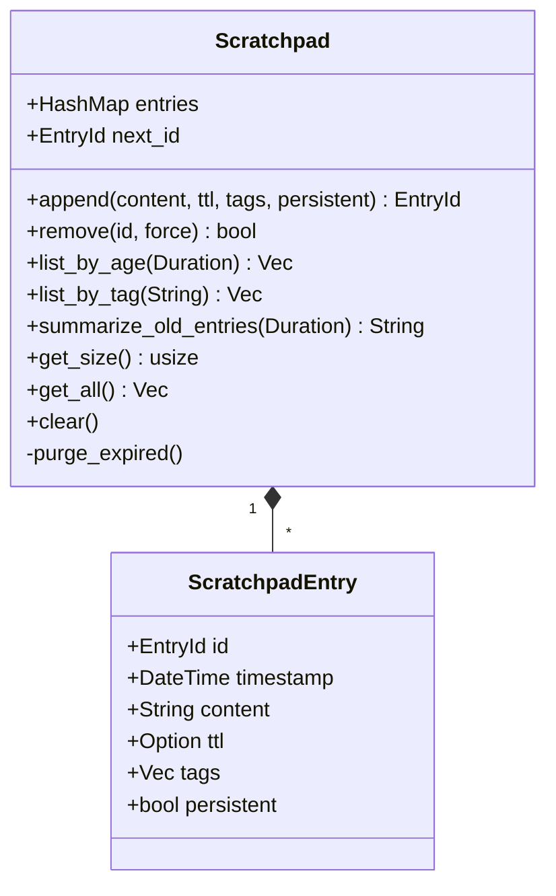

# Implementation Plan: Critical Bugs Fix

## 1. Problem Summary

### Bug 1: Sequential Worker Spawning
- **Location**: `src/terminal/agent_runner.rs` calls `agent.step()` which uses V1's sequential tool execution.
- **Root Cause**: The agent is configured as `AgentVersion::V2`, but the runner bypasses the V2 bridge and calls `step()` directly. The `Agent::step()` method always uses V1 logic, processing one tool at a time, even when V2 is enabled. This prevents parallel tool execution, limiting performance and worker efficiency.

### Bug 2: Workers Looping Infinitely
- **Location 1**: `core/src/agent/tools/delegate.rs` line 437 sets `max_iterations=50` by default for workers.
- **Location 2**: `core/src/agent/v2/driver/event_driven.rs` line 242 resets `consecutive_messages` on *any* action, even failed tool calls.
- **Root Cause**: The default iteration limit is too high for workers, allowing long-running loops. The consecutive message guard (which aborts after 3 non-tool messages) never triggers because the counter is reset before tool execution, so failed calls still reset it.

### Bug 3: Scratchpad Management (Context Bloat)
- **Location**: `core/src/agent/workspace.rs` and `core/src/agent/tools/scratchpad.rs` use a shared `String` that grows unbounded.
- **Root Cause**: The scratchpad is a raw string with no structure, TTL, tags, or cleanup mechanism. Workers can append freely, and there's no way for the main LLM to prune non-essential information, leading to excessive context usage.

---

## 2. Proposed Solutions

### Bug 1: Enable Parallel Tool Execution

**Strategy**: Integrate V2's parallel execution path into `Agent::step()` so that when `version == V2`, the agent uses `execute_parallel_tools()` for short-key actions. The runner loop remains largely unchanged, with a small adjustment to handle V2's `Message` decisions correctly.

**Key Changes**:

1. **Extend `Agent` struct** with V2-specific fields (all `Option` to avoid V1 bloat):
   ```rust
   pub struct Agent {
       // ... existing fields ...
       /// V2-only components (initialized when version == V2)
       pub context_manager: Option<ContextManager>,
       pub scratchpad_tool: Option<ScratchpadTool>,
       pub recovery_worker: Option<RecoveryWorker>,
       pub parse_failure_count: usize,
       pub memory_manager: Option<MemoryManager>,
       pub prompt_builder: Option<PromptBuilder>,
   }
   ```

2. **Initialize V2 components** in `Agent::new_with_config` when `config.version == V2`:
   - Create `ContextManager` from LLM client.
   - Create `MemoryManager` with scribe, store, categorizer.
   - Build `PromptBuilder` after tool registration (using the tool map).
   - Create `ScratchpadTool` and insert into tool registry.
   - Initialize `parse_failure_count = 0`.

3. **Modify `Agent::step()`**:
   - If `self.version == V2 && self.context_manager.is_some()`, execute V2 logic:
     - Scratchpad size checks (add warnings to history).
     - Iteration limit check.
     - Add observation to history (truncated).
     - Use `self.context_manager.prepare_context()` for pruning/condensation.
     - Inject hot memory via `self.memory_manager`.
     - Build request with `self.prompt_builder`.
     - Call LLM.
     - Parse short-key actions: if multiple, call `execute_parallel_tools()` and return `AgentDecision::Message` with summary.
     - For native/ReAct tool calls, return `AgentDecision::Action` (same as V1).
     - Handle parse failures with `self.recovery_worker`.
   - Else, use existing V1 logic.

4. **Update `Agent::generate_system_prompt()`**:
   - If V2, use `self.prompt_builder.get_full_prompt(&scratchpad_content)` instead of the old format.

5. **Update `Agent::reset()`**:
   - Reset V2-specific fields: `context_manager.reset()`, `parse_failure_count = 0`, `memory_manager.reset()`, etc.

6. **Adjust `run_agent_loop` in `src/terminal/agent_runner.rs`**:
   - Import `is_final_response` from `crate::agent::execution`.
   - Modify the `AgentDecision::Message` arm to continue if the message is *not* a final answer:
     ```rust
     Ok(AgentDecision::Message(msg, usage)) => {
         let has_pending = agent_lock.has_pending_decision();
         if has_pending {
             retry_count = 0;
             let _ = event_tx.send(TuiEvent::AgentResponse(msg, usage));
             drop(agent_lock);
             continue;
         }
         // New: check if this is a final answer
         if is_final_response(&msg) {
             let _ = event_tx.send(TuiEvent::AgentResponseFinal(msg, usage));
             break;
         } else {
             // Non-final message (e.g., V2 parallel execution summary)
             retry_count = 0;
             let _ = event_tx.send(TuiEvent::AgentResponse(msg, usage));
             drop(agent_lock);
             continue;
         }
     }
     ```

### Bug 2: Fix Worker Infinite Loops

**Part A - Lower default max_iterations for workers**:
- **File**: `core/src/agent/tools/delegate.rs`
- **Change** line 437:
  ```rust
  let max_iterations = delegate_args.max_iterations.unwrap_or(10); // was 50
  ```

**Part B - Fix consecutive_messages reset**:
- **File**: `core/src/agent/v2/driver/event_driven.rs`
- **In** `handle_step_result`, `AgentDecision::Action` arm:
  - Move `*consecutive_messages = 0;` from before tool execution to inside the `Ok(observation)` branch after setting `last_observation`.
  - Updated logic:
    ```rust
    AgentDecision::Action { tool, args, kind: _ } => {
        let _ = event_tx.send(RuntimeEvent::StatusUpdate {
            message: format!("Executing tool: '{}'", tool)
        });

        match execute_single_tool(agent, &tool, &args, event_tx).await {
            Ok(observation) => {
                *last_observation = Some(observation);
                *consecutive_messages = 0; // Reset only on success
            }
            Err(e) => {
                *last_observation = Some(format!("Tool execution error: {}", e));
                // Do NOT reset consecutive_messages
            }
        }
    }
    ```

### Bug 3: Structured Scratchpad with Cleanup

**Strategy**: Replace the raw `String` scratchpad with a structured entry-based system. Add a background cleanup task triggered from the agent's step loop.

**New Types** (`core/src/agent/scratchpad.rs`):

```rust
use chrono::{DateTime, Utc, Duration};
use serde::{Deserialize, Serialize};
use std::collections::HashMap;

/// Unique identifier for a scratchpad entry
pub type EntryId = u64;

/// A single entry in the scratchpad
#[derive(Debug, Clone, Serialize, Deserialize)]
pub struct ScratchpadEntry {
    pub id: EntryId,
    pub timestamp: DateTime<Utc>,
    pub content: String,
    /// Optional time-to-live: entry auto-removed after this duration
    pub ttl: Option<Duration>,
    /// Categorization tags for filtering
    pub tags: Vec<String>,
    /// If true, the entry is persistent and can only be removed by explicit LLM decision
    pub persistent: bool,
}

/// Managed scratchpad with CRUD operations and cleanup
pub struct Scratchpad {
    entries: HashMap<EntryId, ScratchpadEntry>,
    next_id: EntryId,
}

impl Scratchpad {
    /// Create a new empty scratchpad
    pub fn new() -> Self {
        Self {
            entries: HashMap::new(),
            next_id: 1,
        }
    }

    /// Append a new entry and return its ID
    pub fn append(
        &mut self,
        content: String,
        ttl: Option<Duration>,
        tags: Vec<String>,
        persistent: bool,
    ) -> EntryId {
        let id = self.next_id;
        self.next_id += 1;
        let entry = ScratchpadEntry {
            id,
            timestamp: Utc::now(),
            content,
            ttl,
            tags,
            persistent,
        };
        self.entries.insert(id, entry);
        self.purge_expired(); // Clean up on mutation
        id
    }

    /// Remove an entry by ID (fails if entry is persistent and not forced)
    pub fn remove(&mut self, id: EntryId, force: bool) -> bool {
        if let Some(entry) = self.entries.get(&id) {
            if entry.persistent && !force {
                return false;
            }
            self.entries.remove(&id);
            true
        } else {
            false
        }
    }

    /// List entries older than max_age
    pub fn list_by_age(&self, max_age: Duration) -> Vec<ScratchpadEntry> {
        let cutoff = Utc::now() - max_age;
        self.entries.values()
            .filter(|e| e.timestamp < cutoff)
            .cloned()
            .collect()
    }

    /// List entries containing a specific tag
    pub fn list_by_tag(&self, tag: &str) -> Vec<ScratchpadEntry> {
        self.entries.values()
            .filter(|e| e.tags.contains(&tag.to_string()))
            .cloned()
            .collect()
    }

    /// Generate a summary of old non-persistent entries for LLM review
    pub fn summarize_old_entries(&self, older_than: Duration) -> String {
        let old = self.list_by_age(older_than);
        let mut summary = String::new();
        for entry in old {
            if !entry.persistent {
                summary.push_str(&format!(
                    "[{}] {}...\n",
                    entry.timestamp.format("%Y-%m-%d %H:%M"),
                    &entry.content[..100.min(entry.content.len())]
                ));
            }
        }
        summary
    }

    /// Get total character count across all entries
    pub fn get_size(&self) -> usize {
        self.entries.values().map(|e| e.content.len()).sum()
    }

    /// Get all entries (for serialization or display)
    pub fn get_all(&self) -> Vec<ScratchpadEntry> {
        self.entries.values().cloned().collect()
    }

    /// Clear all entries
    pub fn clear(&mut self) {
        self.entries.clear();
    }

    /// Remove expired entries based on TTL
    fn purge_expired(&mut self) {
        let now = Utc::now();
        let expired: Vec<EntryId> = self.entries.iter()
            .filter(|(_, e)| {
                e.ttl.is_some() && e.timestamp + e.ttl.unwrap() <= now
            })
            .map(|(id, _)| *id)
            .collect();
        for id in expired {
            self.entries.remove(&id);
        }
    }
}
```

**Integration Changes**:

1. **Update `Agent` and `AgentV2`**:
   - Change `scratchpad: Option<Arc<RwLock<String>>>` to `scratchpad: Option<Arc<RwLock<Scratchpad>>>`.
   - Update all reads: `scratchpad.read().map(|g| g.clone())` becomes `scratchpad.read().get_all()`.
   - Update size checks: `scratchpad.read().len()` becomes `scratchpad.read().get_size()`.
   - In `AgentV2::step()`, the warning messages should use `get_size()`.

2. **Update `ScratchpadTool`** (`core/src/agent/tools/scratchpad.rs`):
   - Replace the old `String`-based implementation with the new `Scratchpad`.
   - The tool now holds `scratchpad: Arc<RwLock<Scratchpad>>`.
   - `call` method:
     - `overwrite`: `scratchpad.write().clear(); scratchpad.append(text, None, vec![], persistent=true)`.
     - `append`: `scratchpad.append(text, None, vec![], persistent=true)`.
     - `clear`: `scratchpad.write().clear()`.
     - `ephemeral`: `scratchpad.append(text, Some(Duration::seconds(ttl)), vec![], false)`.
   - Add support for new optional arguments: `tags` (array) and `persistent` (boolean) in the `ScratchpadArgs` struct.
   - Maintain backward compatibility: if only `text` is provided, treat as persistent entry with no tags.

3. **Update `SharedWorkspace`** (`core/src/agent/workspace.rs`):
   - Change `scratchpad: Arc<RwLock<String>>` to `scratchpad: Arc<RwLock<Scratchpad>>`.
   - `get_scratchpad()`: iterate entries and format them into a single string (e.g., `"[timestamp] content\n"`).
   - `add_entry()`: also add the entry to the structured scratchpad (as a non-persistent entry with appropriate tags).
   - `clear()`: clear the scratchpad.

4. **Migration Path**:
   - Provide a conversion constructor: `Scratchpad::from_legacy_string(s: String) -> Self` that creates a single persistent entry with the legacy content.
   - In `Agent::new_with_config`, if `config.scratchpad` is provided and contains a `String` (detected by trying to read it as a string first), replace with `Arc::new(RwLock::new(Scratchpad::from_legacy_string(content)))`.
   - Update all creation sites (e.g., in `core/src/agent/v2/core.rs` line 110) to use the new `Scratchpad` directly.

5. **Add Cleanup Task to AgentV2**:
   - In `AgentV2::step()` (or the V2 part of `Agent::step()`), periodically invoke a cleanup routine:
     - Every 10 steps, or when `scratchpad.get_size() > SCRATCHPAD_CRITICAL_SIZE`, call `manage_scratchpad()`.
   - New method `manage_scratchpad(&mut self)`:
     - Get old non-persistent entries: `scratchpad.read().list_by_age(Duration::hours(1))`.
     - Generate a summary using `summarize_old_entries()`.
     - Use the LLM to decide which entries are safe to delete (prompt: "Here is a list of old scratchpad entries. Which ones can be removed? Return a JSON array of IDs to delete.").
     - Parse the response and call `scratchpad.write().remove(id, false)` for each.
   - This gives the main LLM control over scratchpad hygiene.

---

## 3. File Changes

| File | Changes |
|------|---------|
| `core/src/agent/core.rs` | Add V2 fields; modify `new_with_config`, `step`, `reset`, `generate_system_prompt`; import V2 modules. |
| `core/src/agent/v2/core.rs` | Update to use new `Scratchpad` type; adjust size checks; possibly remove duplicate logic if we unify. |
| `core/src/agent/scratchpad.rs` | **New file** with `ScratchpadEntry`, `Scratchpad` implementation. |
| `core/src/agent/tools/scratchpad.rs` | Rewrite to use `Scratchpad` API; extend args with `tags` and `persistent`; maintain backward compatibility. |
| `core/src/agent/workspace.rs` | Change `scratchpad` field to `Arc<RwLock<Scratchpad>>`; update all methods. |
| `core/src/agent/tools/delegate.rs` | Line 437: change `unwraprap_or(50)` to `unwraprap_or(10)`. |
| `core/src/agent/v2/driver/event_driven.rs` | Move `consecutive_messages = 0` inside `Ok(observation)` branch. |
| `src/terminal/agent_runner.rs` | Import `is_final_response`; modify `Message` arm to continue on non-final messages. |
| `core/src/agent/v2/execution.rs` | No direct changes needed, but will be called from unified `step`. |
| `core/src/agent/factory.rs` | May need to adjust agent creation to initialize V2 components when version is V2. |
| `core/src/agent/mod.rs` | Export new `scratchpad` module. |

---

## 4. New Types (Rust Definitions)

See `core/src/agent/scratchpad.rs` (full implementation in Section 2, Bug 3). Key types:

- `EntryId = u64`
- `ScratchpadEntry` with fields: `id`, `timestamp`, `content`, `ttl`, `tags`, `persistent`.
- `Scratchpad` with methods: `new`, `append`, `remove`, `list_by_age`, `list_by_tag`, `summarize_old_entries`, `get_size`, `get_all`, `clear`.

---

## 5. API Changes

### Modified Functions

- `Agent::step()`: Now dispatches to V2 logic when `version == V2`.
- `Agent::reset()`: Resets V2-specific state.
- `Agent::generate_system_prompt()`: Uses V2 `PromptBuilder` if applicable.
- `run_agent_loop` (`src/terminal/agent_runner.rs`): Enhanced `Message` handling with `is_final_response` check.

### New Methods

- `Scratchpad` API as listed above.
- `Agent::manage_scratchpad()` (private) for periodic cleanup.

### Type Changes

- `Agent::scratchpad`: `Option<Arc<RwLock<String>>>` → `Option<Arc<RwLock<Scratchpad>>>`.
- `AgentV2::scratchpad`: same change.
- `SharedWorkspace::scratchpad`: same change.

---

## 6. Migration Path

1. **Add new `scratchpad` module** and implement `Scratchpad` type.
2. **Update all creation sites** to use `Scratchpad` instead of `String`:
   - In `AgentV2::new_with_config` (line 110): `Arc::new(RwLock::new(Scratchpad::new()))`.
   - In `SharedWorkspace::new`: `Arc::new(RwLock::new(Scratchpad::new()))`.
   - In any test or other constructors.
3. **Provide legacy conversion**: Implement `Scratchpad::from_legacy_string(s: String) -> Scratchpad` that creates a single persistent entry. Use this in `Agent::new_with_config` if a legacy string scratchpad is detected (e.g., by attempting to read it as a string before conversion). This ensures old persisted state (if any) migrates automatically.
4. **Update `ScratchpadTool`** to use the new API while keeping the tool's external JSON interface unchanged (except new optional fields).
5. **Update `SharedWorkspace`** methods to translate between structured entries and the concatenated scratchpad string view.
6. **Run full test suite** to catch any missed accesses.

---

## 7. Risk Analysis

| Risk | Impact | Mitigation |
|------|--------|------------|
| **Bug 1**: V2 integration breaks V1 behavior | High (could break existing agents) | Keep V1 path unchanged; add comprehensive unit tests for both V1 and V2 `step()`; test with both versions in integration. |
| **Bug 1**: Missing V2 field initialization causes panics | High | Initialize all V2 fields only when `version == V2`; use `Option` and `unwrap()` only after checks; add debug assertions. |
| **Bug 3**: Incomplete migration of scratchpad accesses leads to compile errors | Medium | Use IDE-wide search for `scratchpad.read()` and `scratchpad.write()` to find all access points; update systematically. |
| **Bug 3**: Performance degradation due to structured entries | Low | `get_size()` is O(n) but n is small; cache size if needed. |
| **Bug 2**: Lower worker iterations cause premature termination | Medium | 10 iterations is conservative; allow override via `delegate` `max_iterations` parameter; monitor worker completion rates. |
| **Bug 2**: `consecutive_messages` reset logic still flawed | Medium | Ensure reset only on success; add test simulating tool failure to verify guard triggers. |
| **Parallel execution**: Increased token usage | Low | Monitor and possibly add config to limit parallel calls. |

**Testing Strategy**:
- Unit tests for `Scratchpad` CRUD and TTL.
- Integration test: agent with V2 spawns worker that uses parallel tools; verify multiple tools run concurrently.
- Regression test: V1 agent continues to work unchanged.
- Worker loop guard test: simulate worker producing 3 non-tool messages; verify abort.

---

## 8. Implementation Order

1. **Bug 2** (simplest, low risk):
   - Change `delegate.rs` default.
   - Fix `consecutive_messages` reset in `event_driven.rs`.
   - Test worker loop behavior.

2. **Bug 3** (moderate complexity, isolated):
   - Create `core/src/agent/scratchpad.rs` with full implementation.
   - Update `ScratchpadTool` to use new API.
   - Update `SharedWorkspace` to use new API.
   - Update `Agent` and `AgentV2` fields and all accesses.
   - Add legacy conversion in `Agent::new_with_config`.
   - Test scratchpad operations manually.

3. **Bug 1** (most complex, high impact):
   - Add V2 fields to `Agent`.
   - Initialize V2 components in `new_with_config`.
   - Implement V2 logic inside `Agent::step()` (copy/adapt from `AgentV2::step`).
   - Update `generate_system_prompt` and `reset`.
   - Modify `run_agent_loop` to handle non-final `Message`.
   - Test V2 parallel execution thoroughly.

4. **Final Integration**:
   - Run full test suite.
   - Manual testing: spawn a worker that needs multiple tools; verify they run in parallel.
   - Verify scratchpad warnings and cleanup trigger appropriately.

---

## 9. Mermaid Diagrams

### Agent Loop with V2 Parallel Execution

```mermaid
flowchart TD
    A[Start step] --> B{version == V2?}
    B -- No --> C[V1 logic: return Action]
    B -- Yes --> D[Add observation to history]
    D --> E[Context prune/condense]
    E --> F[Memory recall]
    F --> G[Call LLM with tools]
    G --> H{Parse response}
    H -- Short-Key --> I{Multiple tools?}
    I -- Yes --> J[execute_parallel_tools]
    J --> K[Add tool results to history]
    K --> L[Return Message with summary]
    I -- No --> M[Return Action (single tool)]
    H -- Native/ReAct --> M
    L --> N[Runner continues loop]
    M --> N
    C --> O[Runner executes tool]
    O --> N
```

### Scratchpad Structure



---

## 10. Conclusion

This plan addresses all three critical bugs with concrete, incremental changes. The approach prioritizes safety by:
- Keeping V1 and V2 paths separate but unified under `Agent::step()`.
- Providing a migration path for the scratchpad that maintains backward compatibility.
- Ordering implementation from simplest to most complex to reduce risk.

Upon approval, implementation can proceed in the specified order, with thorough testing after each bug fix.
