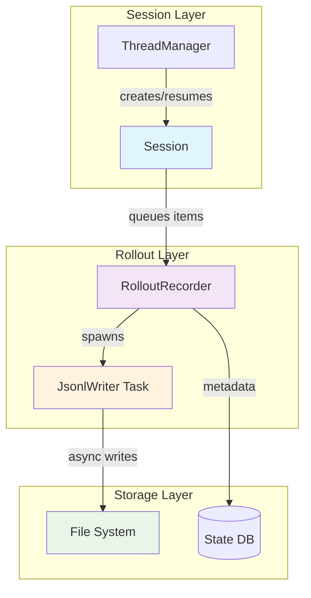

# Codex Rollout Logs Implementation Guide

## Overview

This document provides a comprehensive guide to Codex's rollout logs system, designed to help you implement a similar feature in your own project. The rollout logs system provides persistent, append-only session recording that enables session replay, thread listing, and state reconstruction.

### What Are Rollout Logs?

Rollout logs are JSONL (JSON Lines) files that capture the complete history of a Codex session. Every significant event—user messages, assistant responses, tool calls, system events—is written to a log file as it occurs. This enables:

- **Session persistence**: Sessions can be resumed even after application restart
- **Thread history**: Users can view and search past conversations
- **Forking**: Create new sessions from any point in a previous conversation
- **Debugging**: Inspect what happened during a session
- **Analytics**: Extract metadata for indexing and search

### High-Level Architecture



**Key Components:**

- **`RolloutRecorder`**: Main public interface. Clones into `SessionServices` and provides `record_items()` method. Manages a channel to the background writer task.
- **`JsonlWriter`**: Background task that owns the file handle. Receives items via channel, writes them as JSONL lines, and flushes on demand.
- **`Session`**: Business logic layer that calls `persist_rollout_items()` to record events.
- **`ThreadManager`**: Creates and manages sessions, uses `RolloutRecorder::get_rollout_history()` for resuming/forking.
- **`State DB`** (optional): SQLite database for fast thread metadata indexing, separate from the JSONL files.

---

## Detailed Design

### Data Structures

#### Core Types

```rust
// From codex-rs/core/src/rollout/protocol.rs (simplified)
#[derive(Debug, Clone, Serialize, Deserialize)]
pub enum RolloutItem {
    SessionMeta(SessionMetaLine),
    ResponseItem(ResponseItem),
    Compacted(CompactedItem),
    TurnContext(TurnContextItem),
    EventMsg(EventMsg),
}

// The actual line written to disk
#[derive(Debug, Clone, Serialize)]
pub struct RolloutLine {
    pub timestamp: String,  // ISO 8601 with millisecond precision
    #[serde(flatten)]
    pub item: RolloutItem,
}
```

**Item Types:**

1. **`SessionMeta`**: First line in every file. Contains session metadata:
   - `id`: Thread UUID
   - `timestamp`: Session creation time
   - `cwd`: Working directory
   - `source`: Session source (CLI, VSCode, etc.)
   - `model_provider`: AI provider used
   - `base_instructions`: System prompt
   - `dynamic_tools`: MCP tools available

2. **`ResponseItem`**: The core conversation content. Includes:
   - `Message`: User/assistant messages
   - `FunctionCall` / `FunctionCallOutput`: Tool invocations
   - `CustomToolCall` / `CustomToolCallOutput`: MCP tool calls
   - `Reasoning`: Model reasoning summaries
   - `Compaction`: History compaction markers

3. **`TurnContext`**: Snapshot of turn configuration (model, settings, policies). Written at the start of each turn.

4. **`EventMsg`**: System events like `ThreadRolledBack`, `TokenCount`, `TurnAborted`.

5. **`Compacted`**: Compaction markers that allow reconstructing truncated history.

### Serialization Format

**JSONL Structure:**
```json
{"timestamp":"2025-01-27T12:34:56.123Z","item":{"SessionMeta":{"meta":{...},"git":{...}}}}
{"timestamp":"2025-01-27T12:34:58.456Z","item":{"ResponseItem":{"Message":{"role":"user","content":[...]}}}}
{"timestamp":"2025-01-27T12:35:00.789Z","item":{"ResponseItem":{"Message":{"role":"assistant","content":[...]}}}}
```

**Key Design Decisions:**

- **One JSON object per line**: Enables streaming reads, easy tailing, and line-oriented processing
- **Timestamp on every line**: Facilitates ordering and timing analysis without parsing content
- **Flattened enum**: `RolloutLine` uses `#[serde(flatten)]` to embed the `item` directly, avoiding unnecessary nesting
- **ISO 8601 timestamps**: Human-readable, sortable, RFC 3339 compatible

### File Organization

#### Directory Structure

```
~/.codex/
├── sessions/
│   ├── 2025/
│   │   ├── 01/
│   │   │   ├── 02/
│   │   │   │   ├── rollout-2025-01-02T14-30-00-<uuid1>.jsonl
│   │   │   │   ├── rollout-2025-01-02T15-45-00-<uuid2>.jsonl
│   │   │   │   └── ...
│   │   │   ├── 03/
│   │   │   └── ...
│   │   ├── 02/
│   │   └── ...
├── archived_sessions/
│   └── ... (same structure)
└── session_index.jsonl  # append-only name→id mapping
```

**Naming Convention:**
```
rollout-YYYY-MM-DDThh-mm-ss-<thread-id>.jsonl
```

- **Date-based hierarchy**: `sessions/YYYY/MM/DD/` enables efficient directory traversal and natural organization
- **Timestamp in filename**: `YYYY-MM-DDThh-mm-ss` (using `-` instead of `:` for filesystem compatibility)
- **UUID in filename**: The thread ID is embedded in the filename for easy identification and parsing without reading file contents
- **`.jsonl` extension**: Clear indication of format

**Session Index (`session_index.jsonl`):**

An append-only file mapping thread names to IDs:
```json
{"id":"<uuid>","thread_name":"My Thread","updated_at":"2025-01-27T12:34:56Z"}
{"id":"<uuid>","thread_name":"Another Thread","updated_at":"2025-01-28T10:00:00Z"}
```

The index is scanned **backwards** to find the most recent entry for a given name/ID, avoiding the need for a database for this lookup.

---

## Async Writer Architecture

### The Problem: Non-blocking I/O

The rollout system must write to disk frequently (after every response item) without blocking the main session logic. Blocking I/O would:

- Slow down the agent's response generation
- Cause throughput issues under load
- Risk data loss if the process crashes mid-write

### The Solution: Channel-Based Producer/Consumer

```rust
// From codex-rs/core/src/rollout/recorder.rs

pub struct RolloutRecorder {
    tx: Sender<RolloutCmd>,  // channel sender
    rollout_path: PathBuf,
    state_db: Option<StateDbHandle>,
}

enum RolloutCmd {
    AddItems(Vec<RolloutItem>),
    Flush { ack: oneshot::Sender<()> },
    Shutdown { ack: oneshot::Sender<()> },
}

async fn rollout_writer(
    file: tokio::fs::File,
    mut rx: mpsc::Receiver<RolloutCmd>,
    mut meta: Option<SessionMeta>,
    // ...
) -> std::io::Result<()> {
    let mut writer = JsonlWriter { file };
    // Write SessionMeta first
    if let Some(session_meta) = meta.take() {
        // ... collect git info
        let rollout_item = RolloutItem::SessionMeta(session_meta_line);
        writer.write_rollout_item(&rollout_item).await?;
    }

    // Command loop
    while let Some(cmd) = rx.recv().await {
        match cmd {
            RolloutCmd::AddItems(items) => {
                let mut persisted_items = Vec::new();
                for item in items {
                    if is_persisted_response_item(&item) {
                        writer.write_rollout_item(&item).await?;
                        persisted_items.push(item);
                    }
                }
                // Update state DB asynchronously (fire-and-forget)
                state_db::apply_rollout_items(...).await;
            }
            RolloutCmd::Flush { ack } => {
                writer.file.flush().await?;
                let _ = ack.send(());
            }
            RolloutCmd::Shutdown { ack } => {
                let _ = ack.send(());
                break;
            }
        }
    }
    Ok(())
}
```

**Architecture Benefits:**

1. **Non-blocking**: `record_items()` just sends to a channel (fast, never blocks on I/O)
2. **Backpressure**: Channel buffer (256 slots) provides natural backpressure. If writer falls behind, sender will yield
3. **Ordered writes**: Single consumer ensures writes are sequential and in-order
4. **Graceful shutdown**: `Shutdown` command ensures final flush before exit
5. **Error isolation**: I/O errors in writer don't crash the session; they're logged and the task exits

**Channel Configuration:**

```rust
let (tx, rx) = mpsc::channel::<RolloutCmd>(256);
```

- **Bounded channel**: 256-slot buffer prevents unbounded memory growth
- **Multiple producers**: `RolloutRecorder` clones can be distributed across components
- **Single consumer**: Only one writer task owns the file handle

### JsonlWriter Implementation

```rust
struct JsonlWriter {
    file: tokio::fs::File,
}

impl JsonlWriter {
    async fn write_rollout_item(&mut self, rollout_item: &RolloutItem) -> std::io::Result<()> {
        let timestamp = OffsetDateTime::now_utc()
            .format(timestamp_format)
            .map_err(|e| IoError::other(format!("failed to format timestamp: {e}")))?;

        let line = RolloutLineRef { timestamp, item: rollout_item };
        self.write_line(&line).await
    }

    async fn write_line(&mut self, item: &impl serde::Serialize) -> std::io::Result<()> {
        let mut json = serde_json::to_string(item)?;
        json.push('\n');
        self.file.write_all(json.as_bytes()).await?;
        self.file.flush().await?;  // Ensure durability after each write
        Ok(())
    }
}
```

**Critical Details:**

- **`tokio::fs::File`**: Uses async I/O driver, not blocking std::fs::File
- **Flush after every write**: Ensures durability even if process crashes (though `fsync` is not guaranteed)
- **Timestamp at write time**: Each line gets its own timestamp, not the time the item was generated

---

## Filtering Strategy

Not all events should be persisted. The `is_persisted_response_item()` function implements the filtering policy:

```rust
// From codex-rs/core/src/rollout/policy.rs
pub(crate) fn is_persisted_response_item(item: &RolloutItem) -> bool {
    match item {
        RolloutItem::ResponseItem(item) => should_persist_response_item(item),
        RolloutItem::EventMsg(ev) => should_persist_event_msg(ev),
        // Always persist these markers
        RolloutItem::Compacted(_) | RolloutItem::TurnContext(_) | RolloutItem::SessionMeta(_) => true,
    }
}

fn should_persist_response_item(item: &ResponseItem) -> bool {
    match item {
        ResponseItem::Message { .. }
        | ResponseItem::Reasoning { .. }
        | ResponseItem::LocalShellCall { .. }
        | ResponseItem::FunctionCall { .. }
        | ResponseItem::FunctionCallOutput { .. }
        | ResponseItem::CustomToolCall { .. }
        | ResponseItem::CustomToolCallOutput { .. }
        | ResponseItem::WebSearchCall { .. }
        | ResponseItem::GhostSnapshot { .. }
        | ResponseItem::Compaction { .. } => true,
        ResponseItem::Other => false,  // Unknown/legacy types
    }
}

fn should_persist_event_msg(ev: &EventMsg) -> bool {
    match ev {
        EventMsg::UserMessage(_)
        | EventMsg::AgentMessage(_)
        | EventMsg::AgentReasoning(_)
        | EventMsg::TokenCount(_)
        | EventMsg::ContextCompacted(_)
        | EventMsg::ThreadRolledBack(_)
        | EventMsg::UndoCompleted(_)
        | EventMsg::TurnAborted(_) => true,
        EventMsg::ItemCompleted(event) => {
            // Only plan items (derived from streaming tags)
            matches!(event.item, TurnItem::Plan(_))
        }
        // Exclude: TurnStarted, TurnComplete, deltas, background events, etc.
        _ => false,
    }
}
```

**Filtering Rationale:**

- **Include**: User/assistant messages, tool calls, reasoning, system events that affect state
- **Exclude**: Transient deltas (streaming chunks), turn lifecycle events, background noise
- **Plan items**: Only the completion event is persisted (not every delta), keeping rollouts compact while preserving the final plan

---

## Integration Points

### Session Lifecycle

```rust
// From codex-rs/core/src/codex.rs (Session::new)

impl Session {
    async fn new(
        session_configuration: SessionConfiguration,
        config: Arc<Config>,
        // ...
        initial_history: InitialHistory,
        session_source: SessionSource,
        // ...
    ) -> anyhow::Result<Arc<Self>> {
        let (conversation_id, rollout_params) = match &initial_history {
            InitialHistory::New | InitialHistory::Forked(_) => {
                let conversation_id = ThreadId::default();
                (conversation_id, RolloutRecorderParams::new(
                    conversation_id,
                    forked_from_id,
                    session_source,
                    base_instructions,
                    dynamic_tools,
                ))
            }
            InitialHistory::Resumed(resumed_history) => (
                resumed_history.conversation_id,
                RolloutRecorderParams::resume(resumed_history.rollout_path.clone()),
            ),
        };

        // Spawn RolloutRecorder in parallel with other init tasks
        let rollout_fut = async {
            if config.ephemeral {
                Ok((None, None))
            } else {
                let state_db_ctx = state_db::init_if_enabled(&config, None).await;
                let rollout_recorder = RolloutRecorder::new(
                    &config,
                    rollout_params,
                    state_db_ctx.clone(),
                    state_builder.clone(),
                ).await?;
                Ok((Some(rollout_recorder), state_db_ctx))
            }
        };

        let (rollout_recorder, state_db_ctx) = rollout_fut.await?;

        let services = SessionServices {
            rollout: Mutex::new(rollout_recorder),
            // ...
        };

        Ok(Arc::new(Session { /* ... */ }))
    }
}
```

**Key Integration Points:**

1. **Session creation** (`Session::new`):
   - For new sessions: `RolloutRecorder::new()` creates a new file with `SessionMeta`
   - For resumed sessions: `RolloutRecorder::resume()` opens existing file in append mode
   - Recorder is stored in `SessionServices.rollout` (protected by `Mutex`)

2. **Recording events** (`Session::persist_rollout_items`):
```rust
pub(crate) async fn persist_rollout_items(&self, items: &[RolloutItem]) {
    let recorder = {
        let guard = self.services.rollout.lock().await;
        guard.clone()
    };
    if let Some(rec) = recorder {
        if let Err(e) = rec.record_items(items).await {
            error!("failed to record rollout items: {e:#}");
        }
    }
}
```

3. **Event emission** (`Session::send_event_raw`):
```rust
pub(crate) async fn send_event_raw(&self, event: Event) {
    // ...
    let rollout_items = vec![RolloutItem::EventMsg(event.msg.clone())];
    self.persist_rollout_items(&rollout_items).await;
    if let Err(e) = self.tx_event.send(event).await {
        debug!("dropping event because channel is closed: {e}");
    }
}
```

4. **Flush on shutdown** (`Session::shutdown`):
```rust
let recorder_opt = {
    let mut guard = sess.services.rollout.lock().await;
    guard.take()  // Take ownership to prevent further use
};
if let Some(rec) = recorder_opt {
    if let Err(e) = rec.shutdown().await {
        warn!("failed to shutdown rollout recorder: {e}");
    }
}
```

### ThreadManager Operations

```rust
// From codex-rs/core/src/thread_manager.rs

impl ThreadManager {
    pub async fn resume_thread_from_rollout(
        &self,
        config: Config,
        rollout_path: PathBuf,
        auth_manager: Arc<AuthManager>,
    ) -> CodexResult<NewThread> {
        let initial_history = RolloutRecorder::get_rollout_history(&rollout_path).await?;
        self.resume_thread_with_history(config, initial_history, auth_manager)
            .await
    }

    pub async fn fork_thread(
        &self,
        nth_user_message: usize,
        config: Config,
        path: PathBuf,
    ) -> CodexResult<NewThread> {
        let history = RolloutRecorder::get_rollout_history(&path).await?;
        let history = truncate_before_nth_user_message(history, nth_user_message);
        self.state.spawn_thread(config, history, /* ... */).await
    }
}
```

**Operations Enabled:**

- **Resume**: Load entire rollout file, reconstruct in-memory history
- **Fork**: Load rollout, truncate before N-th user message, start new session with that prefix
- **List**: `RolloutRecorder::list_threads()` scans filesystem, extracts metadata from file headers

---

## Error Handling & Edge Cases

### I/O Errors

The implementation handles various I/O error conditions:

```rust
// From codex-rs/core/src/rollout/error.rs
fn map_rollout_io_error(io_err: &std::io::Error, codex_home: &Path) -> Option<CodexErr> {
    let sessions_dir = codex_home.join(SESSIONS_SUBDIR);
    let hint = match io_err.kind() {
        ErrorKind::PermissionDenied => format!(
            "Codex cannot access session files at {} (permission denied). \
            If sessions were created using sudo, fix ownership: \
            sudo chown -R $(whoami) {}",
            sessions_dir.display(),
            codex_home.display()
        ),
        ErrorKind::NotFound => format!(
            "Session storage missing at {}. Create the directory or choose a different Codex home.",
            sessions_dir.display()
        ),
        ErrorKind::AlreadyExists => format!(
            "Session storage path {} is blocked by an existing file. \
            Remove or rename it so Codex can create sessions.",
            sessions_dir.display()
        ),
        ErrorKind::InvalidData | ErrorKind::InvalidInput => format!(
            "Session data under {} looks corrupt or unreadable. \
            Clearing the sessions directory may help (this will remove saved threads).",
            sessions_dir.display()
        ),
        ErrorKind::IsADirectory | ErrorKind::NotADirectory => format!(
            "Session storage path {} has an unexpected type. \
            Ensure it is a directory Codex can use for session files.",
            sessions_dir.display()
        ),
        _ => return None,
    };
    Some(CodexErr::Fatal(format!("{hint} (underlying error: {io_err})")))
}
```

**Common Error Scenarios:**

1. **Permission denied**: Sessions directory not writable (e.g., created with `sudo`)
2. **Disk full**: `write_all()` will return `IoError` with `ErrorKind::Other`. The writer task will exit, but session continues (with logging)
3. **Corrupt JSON lines**: `load_rollout_items()` skips malformed lines, logs warnings, and continues
4. **File system full**: Writes fail, error logged, session continues (best-effort persistence)

### Concurrent Access

**Strategy:** Single-writer, multiple-readers via `Mutex<Option<RolloutRecorder>>`

- Only one `RolloutRecorder` exists per session (stored in `SessionServices`)
- Access is serialized via `Mutex` lock (contended only when recording, which is fast)
- The writer task is the **only** owner of the file handle
- On shutdown, the recorder is `take()`n from the mutex to prevent further use

### Malformed JSON Recovery

```rust
// From codex-rs/core/src/rollout/recorder.rs
pub(crate) async fn load_rollout_items(
    path: &Path,
) -> std::io::Result<(Vec<RolloutItem>, Option<ThreadId>, usize)> {
    let text = tokio::fs::read_to_string(path).await?;
    let mut items = Vec::new();
    let mut parse_errors = 0usize;

    for line in text.lines() {
        if line.trim().is_empty() { continue; }

        let v: Value = match serde_json::from_str(line) {
            Ok(v) => v,
            Err(e) => {
                warn!("failed to parse line as JSON: {line:?}, error: {e}");
                parse_errors = parse_errors.saturating_add(1);
                continue;
            }
        };

        match serde_json::from_value::<RolloutLine>(v.clone()) {
            Ok(rollout_line) => {
                // Process item...
                items.push(/* ... */);
            }
            Err(e) => {
                warn!("failed to parse rollout line: {e}");
                parse_errors = parse_errors.saturating_add(1);
            }
        }
    }
    Ok((items, thread_id, parse_errors))
}
```

**Recovery Strategy:**

- **Skip malformed lines**: Don't fail entire file load due to one bad line
- **Log warnings**: Each parse error is logged with `warn!` level
- **Continue processing**: Valid lines before/after error are still loaded
- **Return parse error count**: Caller can decide if too many errors indicate corruption

### Graceful Degradation

If `RolloutRecorder::new()` fails (e.g., disk full, permission denied):

```rust
// From codex-rs/core/src/codex.rs
let rollout_fut = async {
    if config.ephemeral {
        Ok((None, None))
    } else {
        let state_db_ctx = state_db::init_if_enabled(&config, None).await;
        let rollout_recorder = RolloutRecorder::new(
            &config,
            rollout_params,
            state_db_ctx.clone(),
            state_builder.clone(),
        ).await?;
        Ok((Some(rollout_recorder), state_db_ctx))
    }
};

let (rollout_recorder, state_db_ctx) = rollout_fut.await?;  // Returns error if fails
```

- **`config.ephemeral` mode**: Skips persistence entirely (for testing or temporary sessions)
- **Error propagation**: If recorder fails to initialize, session creation fails with a user-friendly error
- **Session continues**: Once recorder is running, if it crashes later, the session continues (errors are logged, not fatal)

---

## Performance Considerations

### Async Non-blocking I/O

- **`tokio::fs::File`**: Uses async I/O driver (epoll/kqueue/IOCP), no thread pool blocking
- **`write_all()` + `flush()`**: Each item is written and flushed immediately. This provides durability but could be optimized with batched writes for high-throughput scenarios
- **`spawn_blocking` for metadata extraction**: `scan_index_from_end()` uses blocking I/O but offloads to `spawn_blocking` to avoid blocking async runtime

### Channel Buffering

```rust
let (tx, rx) = mpsc::channel::<RolloutCmd>(256);
```

- **Buffer size 256**: Allows bursty event generation (e.g., rapid tool calls) without blocking
- **Backpressure**: When buffer fills, `tx.send()` will yield, naturally throttling producers
- **Memory bound**: 256 commands × ~1KB each = ~256KB max buffered (acceptable)

### Flush Behavior

- **Per-item flush**: `JsonlWriter::write_line()` calls `flush()` after every write
  - **Pros**: Guarantees durability, easy recovery after crash
  - **Cons**: Higher syscall overhead, slower for high-frequency writes
- **Explicit flush**: `RolloutRecorder::flush()` sends `Flush` command, waits for ack
  - Used at session boundaries (e.g., before fork, on shutdown)
  - Ensures all queued items are durably written

### Memory Usage

- **Writer task**: Only holds one `RolloutLine` in memory at a time (plus channel buffer)
- **Session history**: In-memory history is separate from rollout (can be truncated/compacted independently)
- **No caching**: Rollout files are read on-demand for listing/resuming, not cached

### Scalability Limits

- **File scan cap**: `MAX_SCAN_FILES = 10000` when listing threads. Prevents OOM on directories with millions of files
- **Head record limit**: `HEAD_RECORD_LIMIT = 10` when reading thread summaries. Only first few lines parsed to extract metadata
- **Pagination**: Thread listing uses cursor-based pagination to avoid scanning entire directory tree

---

## Lessons Learned & Best Practices

### What Works Well

1. **Separation of concerns**: Writer task isolates I/O from business logic
2. **Channel-based communication**: Simple, efficient, built-in backpressure
3. **JSONL format**: Human-readable, easy to parse, streaming-friendly
4. **Date-based directory structure**: Natural organization, easy to prune old sessions
5. **Filtering policy**: `is_persisted_response_item()` keeps file size manageable while preserving essential data
6. **Graceful error handling**: Malformed lines don't crash the system; I/O errors are logged, not fatal
7. **State DB integration**: Optional SQLite index provides fast lookup without sacrificing simplicity

### Known Limitations

1. **No compression**: JSONL files are plain text. For high-volume sessions, consider gzip compression (would require decompression on read)
2. **Single writer per session**: Cannot have multiple concurrent writers (but this is by design for ordering)
3. **No encryption**: Sensitive data in logs is plaintext. Consider encrypting at rest if needed
4. **Flush per write**: Durability comes at performance cost. Could batch writes for better throughput
5. **Filename parsing**: UUID extraction from filename is brittle (relies on last `-`). Better to store UUID in a separate index file
6. **Directory traversal**: Scanning `sessions/YYYY/MM/DD/` can be slow with many files. The `session_index.jsonl` helps but is not used for all operations

### Potential Improvements

1. **Batched writes**: Accumulate items and flush periodically (e.g., every 100ms or 100 items) for better I/O efficiency
2. **Compression**: Add optional gzip compression for archived sessions
3. **Checksums**: Store SHA256 of each line or file for integrity verification
4. **Rotation**: Auto-archive sessions older than N days to `archived_sessions/`
5. **Concurrent compaction**: Allow compaction to happen in background without blocking writes
6. **Schema versioning**: Include a version number in `SessionMeta` for forward/backward compatibility

### Recommendations for mylm Implementation

1. **Start simple**: Implement basic JSONL writer first, then add features (filtering, state DB, etc.)
2. **Use tokio**: The async channel pattern is essential for non-blocking I/O
3. **Plan for filtering**: Define your persistence policy early; it's harder to change later
4. **Test recovery**: Intentionally corrupt a file and verify your loader can recover
5. **Consider access patterns**: How will you list/search sessions? Design directory structure accordingly
6. **Monitor file growth**: Add metrics for rollout file size and count; set up alerts
7. **Backup strategy**: If sessions are important, implement periodic backups (e.g., copy to S3)
8. **Security**: If sessions contain sensitive data, implement encryption at rest and secure file permissions

---

## Configuration & Customization

### Log Directory

```rust
// Config determines where sessions are stored
let config = Config {
    codex_home: PathBuf::from("/path/to/.codex"),
    // ...
};

// RolloutRecorder uses:
let mut dir = config.codex_home.clone();
dir.push(SESSIONS_SUBDIR);  // "sessions"
dir.push(timestamp.year().to_string());
dir.push(format!("{:02}", u8::from(timestamp.month())));
dir.push(format!("{:02}", timestamp.day()));
```

**Customization Points:**

- **`codex_home`**: Root directory for all Codex data (default `~/.codex`)
- **`SESSIONS_SUBDIR`**: Constant `"sessions"` (could be made configurable)
- **`ARCHIVED_SESSIONS_SUBDIR`**: Constant `"archived_sessions"`

### Environment Variables

Codex does not currently use environment variables for rollout configuration. All settings come from `Config.toml` or command-line flags.

**Potential env vars for mylm:**

- `MYLM_SESSIONS_DIR`: Override default sessions directory
- `MYLM_ROLLOUT_FLUSH_INTERVAL`: Batch flush interval (ms)
- `MYLM_ROLLOUT_COMPRESS`: Enable gzip compression for archived sessions
- `MYLM_ROLLOUT_RETENTION_DAYS`: Auto-delete sessions older than N days

### Filtering Policies

The `is_persisted_response_item()` function is the primary customization point for what gets recorded:

```rust
// To customize, modify these functions in codex-rs/core/src/rollout/policy.rs
pub(crate) fn should_persist_response_item(item: &ResponseItem) -> bool {
    // Add/remove item types based on your needs
}

pub(crate) fn should_persist_event_msg(ev: &EventMsg) -> bool {
    // Control which system events are recorded
}
```

**Common customizations:**

- **Exclude tool calls**: Set `should_persist_response_item` to return `false` for `FunctionCall`/`CustomToolCall` to reduce file size
- **Include more events**: Add additional `EventMsg` variants to capture more system activity
- **Sampling**: For high-volume sessions, record only 1 out of N items (be careful—this breaks replay)

---

## Conclusion

Codex's rollout logs system demonstrates a production-grade implementation of session persistence with:

- **Reliability**: Async I/O, error recovery, graceful degradation
- **Performance**: Non-blocking writes, channel buffering, efficient scanning
- **Simplicity**: JSONL format, straightforward directory structure
- **Extensibility**: Filtering policy, optional state DB, modular architecture

When implementing a similar system in mylm, focus on:

1. **Correctness first**: Ensure every event is recorded exactly once, in order
2. **Durability**: Flush writes frequently; consider `fsync` if crash recovery is critical
3. **Recovery**: Test loading corrupted/malformed files; skip bad lines, continue
4. **Scalability**: Design directory structure and indexing for your expected session volume
5. **Observability**: Add metrics for file sizes, write latency, error counts

The complete implementation spans approximately 2,500 lines of Rust across 8 files in `codex-rs/core/src/rollout/`. Study the source for deeper understanding of edge cases and optimization details.

---

## References

- **Source code**: `codex-rs/core/src/rollout/`
  - [`mod.rs`](codex-rs/core/src/rollout/mod.rs): Module exports and constants
  - [`recorder.rs`](codex-rs/core/src/rollout/recorder.rs): `RolloutRecorder` and `JsonlWriter`
  - [`policy.rs`](codex-rs/core/src/rollout/policy.rs): Filtering logic
  - [`list.rs`](codex-rs/core/src/rollout/list.rs): Thread listing and pagination
  - [`metadata.rs`](codex-rs/core/src/rollout/metadata.rs): Metadata extraction and backfill
  - [`session_index.rs`](codex-rs/core/src/rollout/session_index.rs): Name→ID index
  - [`truncation.rs`](codex-rs/core/src/rollout/truncation.rs): Forking/truncation logic
  - [`error.rs`](codex-rs/core/src/rollout/error.rs): Error mapping and hints
- **Integration**: `codex-rs/core/src/codex.rs` (Session), `codex-rs/core/src/thread_manager.rs`
- **Protocol types**: `codex-protocol/src/protocol/rollout.rs` (RolloutItem, RolloutLine, etc.)

---

*Document version: 1.0 | Based on Codex commit: main (2025-01)*
