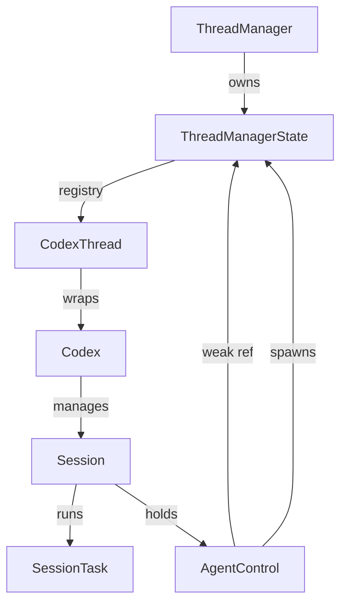

# Implementation Guide: ThreadManager Pattern for Multi-Agent Lifecycle

This document describes the **ThreadManager** pattern used in Codex for managing multi-agent lifecycles, resource isolation, and inter-agent communication. This pattern is designed to replace monolithic agent designs with a registry-based system that supports dynamic spawning and supervision.

## 1. Problem Statement

As agentic systems evolve, a monolithic `Agent` design (like the early `AgentV2`) becomes problematic for several reasons:

- **Lifecycle Complexity**: Managing multiple independent tasks within a single instance leads to "god objects" that are hard to test and maintain.
- **Resource Contention**: Different tasks (e.g., a background codebase indexer vs. an active chat) should have isolated token limits, history, and tool access.
- **Context Switching**: Swapping between unrelated tasks in a single history "pollutes" the model's context.
- **UI Scalability**: Front-ends need to display a list of active tasks, switch between them, and monitor their individual statuses.

### Benefits of the ThreadManager Pattern
- **Registry Pattern**: Centralized lookup for all active agent instances.
- **Isolation**: Each "Thread" has its own `Session`, `History`, and `RolloutRecorder`.
- **Dynamic Spawning**: Agents can spawn sub-agents for specialized tasks (e.g., an "Explorer" for searching code).
- **Graceful Management**: Uniform API for interrupting, shutting down, or monitoring agents.

---

## 2. Architecture Overview

Codex uses a hierarchical architecture where `ThreadManager` acts as the root coordinator.

### High-Level Components (Mermaid)



### Key Modules
- [`thread_manager.rs`](codex-rs/core/src/thread_manager.rs): The central registry and coordinator.
- [`agent/control.rs`](codex-rs/core/src/agent/control.rs): Messaging handle passed into agents to allow them to spawn/message others.
- [`codex_thread.rs`](codex-rs/core/src/codex_thread.rs): A thread-safe wrapper around a specific agent instance.
- [`tasks/mod.rs`](codex-rs/core/src/tasks/mod.rs): Trait-based system for defining agent behaviors (chat, review, etc.).

---

## 3. Core Components

### `ThreadManager` & `ThreadManagerState`
The `ThreadManager` is the public-facing API, while `ThreadManagerState` holds the `Arc`-protected data.

```rust
// codex-rs/core/src/thread_manager.rs

pub struct ThreadManager {
    state: Arc<ThreadManagerState>,
}

pub(crate) struct ThreadManagerState {
    // Registry of all active threads
    threads: Arc<RwLock<HashMap<ThreadId, Arc<CodexThread>>>>,
    // Channel for announcing new threads to subscribers (e.g. UI)
    thread_created_tx: broadcast::Sender<ThreadId>,
    // Shared services
    auth_manager: Arc<AuthManager>,
    models_manager: Arc<ModelsManager>,
    skills_manager: Arc<SkillsManager>,
}
```

### `AgentControl`
A lightweight handle that allows an agent to "reach back" to the manager without creating circular `Arc` references.

```rust
// codex-rs/core/src/agent/control.rs

pub(crate) struct AgentControl {
    /// Weak handle back to the global thread registry.
    manager: Weak<ThreadManagerState>,
    /// Limits and guards (e.g., max 5 active sub-agents).
    state: Arc<Guards>,
}
```

### `SessionTask` Trait
Encapsulates a specific workflow. This allows the same `Session` infrastructure to run different types of logic.

```rust
// codex-rs/core/src/tasks/mod.rs

#[async_trait]
pub(crate) trait SessionTask: Send + Sync + 'static {
    fn kind(&self) -> TaskKind;

    async fn run(
        self: Arc<Self>,
        session: Arc<SessionTaskContext>,
        ctx: Arc<TurnContext>,
        input: Vec<UserInput>,
        cancellation_token: CancellationToken,
    ) -> Option<String>;
}
```

---

## 4. Lifecycle Management

### Spawning an Agent
Agents can be spawned either from the root (via user action) or by another agent (delegation).

1. **Root Spawn**: `thread_manager.start_thread(config)`
2. **Sub-Agent Spawn**: `agent_control.spawn_agent(config, prompt)`

```rust
// Example: Spawning from AgentControl
let sub_agent_id = control.spawn_agent(worker_config, task_prompt).await?;
```

### Configuration Inheritance
Sub-agents often inherit the `cwd`, `model`, and `auth` of their parent, but can apply **AgentRoles** (Worker, Explorer) to override behavior.

```rust
// codex-rs/core/src/agent/role.rs

pub enum AgentRole {
    Default,    // Inherit everything
    Worker,     // Task-executing (fixed model/instructions)
    Explorer,   // Code search (fast model, read-only sandbox)
}
```

### Graceful Shutdown
`ThreadManager` sends an `Op::Shutdown` to the thread's queue. The `Session` then cancels the active `SessionTask`'s `CancellationToken` and flushes the `RolloutRecorder`.

---

## 5. Message Routing & Communication

Communication is **asynchronous** and based on a queue-pair (Submission/Event) model.

1. **Sending**: Use `ThreadManager::send_op(thread_id, op)`. This pushes an `Op` (UserInput, Interrupt, Shutdown) into the agent's channel.
2. **Receiving**: The agent's `submission_loop` processes the queue.
3. **Broadcasting**: Agents emit `Event` messages which are consumed by the front-end or other interested subscribers.

### Inter-Agent Patterns
- **Orchestrator-Worker**: A parent agent spawns multiple workers, sends them prompts, and subscribes to their status/events to aggregate results.
- **Contextual Injection**: Use `Op::AddToHistory` to inject facts into an agent's memory without starting a new turn.

---

## 6. Implementation Roadmap

If migrating from a monolithic `AgentV2`, follow these steps:

### Step 1: Extract Thread Identity
- Define `ThreadId` (UUID or String).
- Create a `ThreadRegistry` (simple `HashMap<ThreadId, Agent>`).

### Step 2: Implement `AgentControl`
- Create a handle that agents use to request actions from the registry.
- Ensure it uses `Weak` references to the registry.

### Step 3: Refactor Agent into `Session` + `Task`
- Move generic queue-handling and history management into a `Session`.
- Move specific logic (chat, search) into `SessionTask` implementations.

### Step 4: Add Supervision Guards
- Implement `MAX_THREAD_SPAWN_DEPTH` to prevent infinite agent recursion.
- Add `agent_max_threads` limit to the global config.

### Common Pitfalls
- **Circular References**: Always use `Weak` in `AgentControl`.
- **Dangling Rollouts**: Ensure `RolloutRecorder` is flushed before the agent is dropped from the registry.
- **Turn Deadlocks**: Avoid blocking the main submission loop; always spawn `SessionTask::run` on a background task.

---

## 7. Decision Criteria: When to Adopt?

| Signal | Implementation Path |
| :--- | :--- |
| Single chat interface only | Keep monolithic |
| Multiple tabs / concurrent tasks | **Adopt ThreadManager** |
| Agent needs to delegate to specialists | **Adopt ThreadManager** |
| Need to "Undo" or "Fork" history | **Adopt ThreadManager** |
| Large history causes latency | **Adopt ThreadManager** (Isolation) |

---

## 8. Integration Example

How `ThreadManager` links systems together:

```rust
// codex-rs/core/src/thread_manager.rs:415
let thread = Arc::new(CodexThread::new(
    codex,
    session_configured.rollout_path.clone(),
));
let mut threads = self.threads.write().await;
threads.insert(thread_id, thread.clone());
```

This ensures that every thread is:
1. **Recorded**: Linked to a rollout file for persistence.
2. **Accessible**: Addressable by `ThreadId` from any part of the system.
3. **Independently Controllable**: Can be interrupted without affecting other agents.
