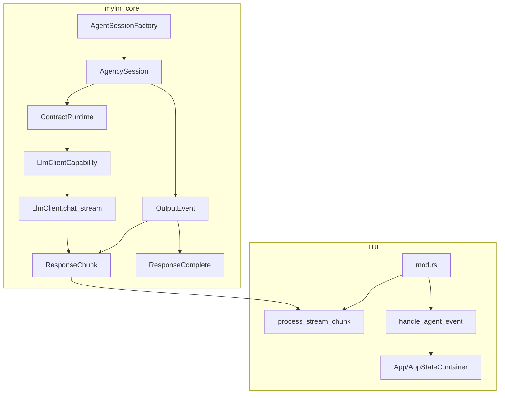
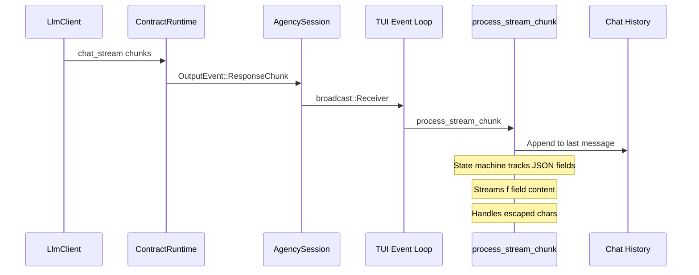

# TUI Streaming Implementation Fix Plan

## Problem Summary

The TUI codebase has structural issues preventing proper streaming implementation:

1. **`src/tui/app/state.rs`** references types that don't exist in `mylm_core::agent`:
   - `Agent`, `AgentOrchestrator`, `ChatSessionHandle` - not exported
   - `AgentWrapper`, `EventBus` - not exported
   - `v2::jobs::JobRegistry` - v2 module doesn't exist
   - `tools::StructuredScratchpad` - tools module doesn't exist

2. **`src/tui/mod.rs`** has a streaming parser but uses `stub.rs` types instead of real ones

3. **`src/tui/stub.rs`** was temporary development stub, should be removed

## Current Architecture



## Solution

### Phase 1: Fix AppStateContainer

Remove references to non-existent types and use the new contract types:

**Before:**
```rust
use mylm_core::agent::{Agent, AgentOrchestrator, ChatSessionHandle};
use mylm_core::agent::v2::jobs::JobRegistry;
use mylm_core::agent::{AgentWrapper, EventBus};
```

**After:**
```rust
use mylm_core::agent::contract::session::{Session, OutputEvent, UserInput};
use mylm_core::agent::factory::AgentSessionFactory;
```

### Phase 2: Add Streaming State Fields

Add to `AppStateContainer`:
```rust
// Streaming parser state
pub stream_state: StreamState,
pub stream_escape_next: bool,
pub stream_key_buffer: String,
pub stream_lookback: String,
pub stream_thought: Option<String>,

// Agent session channels
pub output_rx: Option<tokio::sync::broadcast::Receiver<OutputEvent>>,
pub input_tx: Option<tokio::sync::mpsc::Sender<UserInput>>,
```

### Phase 3: Update mod.rs

1. Remove `stub.rs` module reference
2. Use `AppStateContainer` directly as `App`
3. Wire `OutputEvent::ResponseChunk` to `process_stream_chunk`
4. Handle all `OutputEvent` variants properly

### Phase 4: Streaming Parser

The streaming parser in `mod.rs` is correct but needs to:
1. Use `StreamState` from `state.rs` instead of local enum
2. Handle lookback buffer for patterns spanning chunks
3. Properly unescape JSON strings

## Files to Modify

| File | Changes |
|------|---------|
| `src/tui/app/state.rs` | Remove dead imports, add streaming fields |
| `src/tui/mod.rs` | Remove stub, use real types, fix streaming |
| `src/tui/stub.rs` | Delete or mark as deprecated |

## Implementation Order

1. Fix `state.rs` imports and add streaming fields
2. Update `mod.rs` to use correct types
3. Wire the streaming parser to `OutputEvent::ResponseChunk`
4. Test with real LLM responses
5. Remove `stub.rs` if no longer needed

## Streaming Flow



## Success Criteria

- [ ] TUI compiles without errors
- [ ] Streaming displays content in real-time
- [ ] Escaped characters render correctly
- [ ] Thoughts can be displayed separately
- [ ] No dependency on stub.rs
